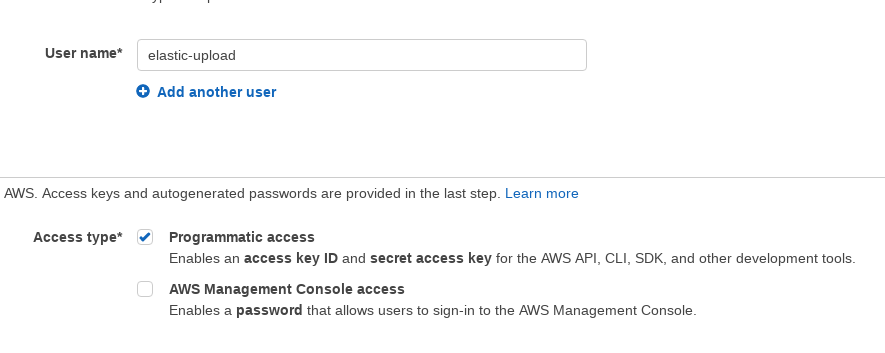
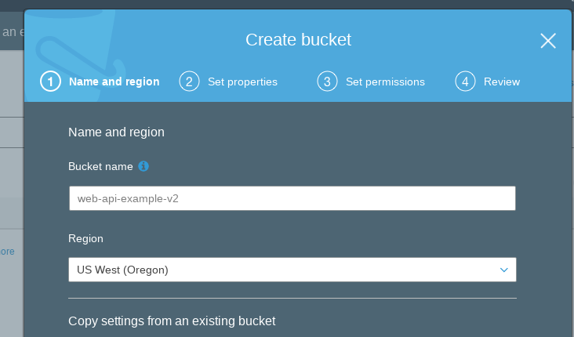

[AWS Elastic Beanstalk](https://aws.amazon.com/elasticbeanstalk/) is well established service of the AWS cloud and can be used as a powerful platform to deploy applications in various languages. In this short tutorial, I will outline how to conveniently deploy a Tomcat application to AWS Elastic Beanstalk using the [beanstalk-maven-plugin.](http://beanstalker.ingenieux.com.br/beanstalk-maven-plugin)

The following assumes that you already have a project which is configured to be deployed as WAR and provides a valid web.xml to start answering requests. If you are unsure of how to set this up, please have a look at the example project [web-api-example-v2](https://github.com/mxro/web-api-example-v2) (on GitHub).

### Step 1: Create IAM User

- Create a new user on IAM user AWS for programmatic access



- For Permissions, select 'Attach existing policies directly' and add the following policy


- Save the access key and secret key

### Step 2: Add Server to Local Maven Configuration

- Add the following declaration in the element in your $HOME/.m2/settings.xml and provide the access key and secret key for the the user you've just created

```xml


<server>
  <id>aws.amazon.com</id>
  <username>[aws access key]</username>
  <password>[aws secret key]</password>
</server>

```

### Step 3: Add Beanstalk Maven Plugin

- Add the [beanstalk-maven-plugin](http://beanstalker.ingenieux.com.br/beanstalk-maven-plugin) to your project pom.xml

```xml


<plugin>
  <groupId>br.com.ingenieux</groupId>
  <artifactId>beanstalk-maven-plugin</artifactId>
  <version>1.5.0</version>
</plugin>

```

- Test your security credentials and connection to AWS

```


mvn beanstalk:check-availability -Dbeanstalk.cnamePrefix=test-war

```

### Step 4: Create S3 Bucket for Application

- Create a new S3 bucket with a name of your choice (e.g. the name of your application)



### Step 5: Update Plugin Configuration

- Provide the following configuration for the beanstalk-maven-plugin

```xml

<plugin>
  <groupId>br.com.ingenieux</groupId>
  <artifactId>beanstalk-maven-plugin</artifactId>
  <version>1.5.0</version>
  <configuration>
    <applicationName>[Provide your application name]</applicationName>
    <!-- Path of the deployed application: cnamePrefix.us-east-1.elasticbeanstalk.com -->
    <cnamePrefix>${project.artifactId}</cnamePrefix>
    <environmentName>devenv</environmentName>
    <environmentRef>devenv</environmentRef>
    <solutionStack>64bit Amazon Linux 2015.03 v1.4.5 running Tomcat 8 Java 8</solutionStack>

    <!-- Bucket name here equal to artifactId - but this is not guaranteed      to be available, so therefore the bucket name is given statically -->
    <s3Bucket>[Provide your S3 bucket name]</s3Bucket>
    <s3Key>${project.artifactId}/${project.build.finalName}-${maven.build.timestamp}.war</s3Key>
    <versionLabel>${project.version}</versionLabel>
  </configuration>
</plugin>
```

### Step 6: Deploy project

- Run the following to upload the project to the S3 bucket:

```

mvn beanstalk:upload-source-bundle
```

- If this succeeds, deploy the application

```


mvn beanstalk:upload-source-bundle beanstalk:create-application-version beanstalk:create-environment

```

Your application should now be deployed to Elastic Beanstalk. It will be available under

```


cname.us-east-1.elasticbeanstalk.com

```

Where cname is the cname you have specified in step 5

### Good To Know

- To find out, which solution stacks are available (to define the solutionStack environment variable), simply run

```


mvn beanstalk:list-stacks

```

### References

- [Spring Boot AWS Elastic Beanstalk example](https://exampledriven.wordpress.com/2017/01/09/spring-boot-aws-elastic-beanstalk-example/)
- [AWS Elastic Beanstalk / API Reference / Actions](https://docs.aws.amazon.com/elasticbeanstalk/latest/api/API_Operations.html)
