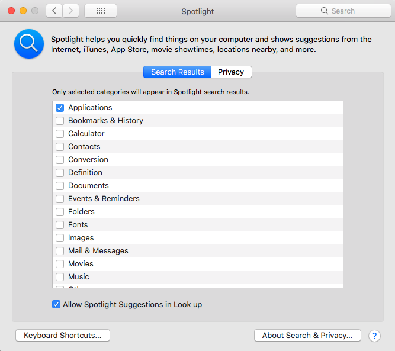

---
authors:
- max
blog: maxrohde.com
date: "2018-09-02"
title: 'Tech Tip: Make Spotlight Searches Faster on Mac OS X'
---

One of the things I really like about Windows 10, is the ability to hit the Windows key and type the first few letters of the application name to find and open this application. Mac OS X in theory provides the same feature by hitting the Command Key + Space. This opens a spotlight search.

Unfortunately I found this search to be inferior to the one found in Windows since it works slower - even on my very powerful Mac machine, it often takes more than a two to three seconds to 'find' the application I try to open.

Last week, I found a way to somewhat mitigate this. Just head to the settings and in there to Spotlight. Disable all the categories apart from 'applications'.

While this does make the search faster, also note that it won't search for the other types of content anymore.
