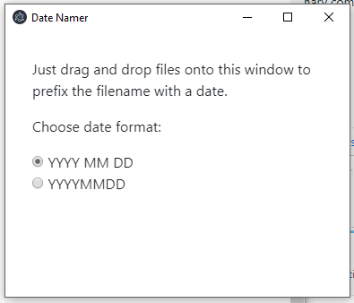

---
categories:
- javascript
coverImage: date-namer.png
date: "2018-09-30"
blog: maxrohde.com
tags:
- open-source
- tools
title: Free Tool for Renaming Files with Current Date
---

For many files, it is good to keep track of when they were originally created. In theory, every file created on any mainstream operating system should have its 'creation date' and 'last date modified' recorded as part of its metadata. This mechanisms, however, is often unreliable, especially when using file synchronisation tools such as Dropbox or Google Drive.

Thus it is often handy to prefix file names with the date they were created, such as:

2018 09 30 Letter.pdf

There are some nice tools available for this purpose, for instance [Bulk Rename Utility](https://www.bulkrenameutility.co.uk/Download.php). However, I often find these a bit too complex for what I need.

I have thus developed a little tool - **Date Namer** - , which does just the one thing I require: To prefix file names with the current date.

Be welcome to download this tool from here:

- [Date Namer Setup 0.1.1.exe](https://github.com/mxro/date-renamer/releases/download/0.1.1/Date.Namer.Setup.0.1.1.exe)

Upcoming release will be published on this page: [Releases](https://github.com/mxro/date-renamer/releases/). Further, all the source code for this tool is available on [GitHub](https://github.com/mxro/date-renamer).

For those interested in the implementation details: For this project, I tried using [Electron](https://electronjs.org/). This allows developing a Desktop application using [Node.js](https://nodejs.org/en/). I found this overall quite easy to use. Internally this application will run an instance of Chromium to render the application. The running application takes thus around 50 MB of RAM. I think this is not too bad for this use case. The app performance is very good.