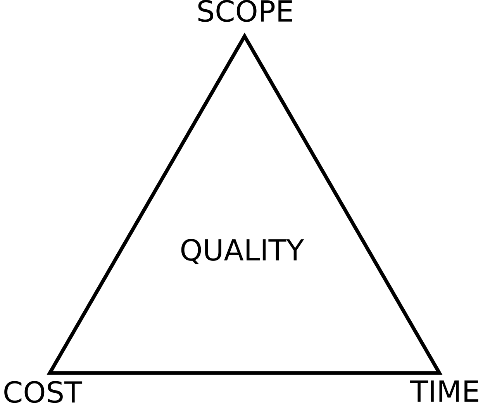

Time is a key resource in software development and we need to consider it in two fundamental ways:

(1) Total amount of effort measured by time goes into delivering software.

(2) Deadlines by which the software needs to be completed.

The [project management triangle](https://en.wikipedia.org/wiki/Project_management_triangle) provides the insight that these two elements of time are intertwined. If attempt to complete a project quicker (reduce TIME), we need to exert more effort to do so (increase COST).

But chances are that if you are developing software, you are not too bothered with project management theory but instead are using an agile methodology to organise your work.

However, to some degree deadlines and estimates cannot be avoided. If the costs resulting from this effort outweigh the benefits derived from the software, it is probably a good idea not to develop in the first place. Moreover, often external factors dictate a specific date by which a piece of work needs to be completed.

This article is a discussion of how deadlines and estimates fit within the world of agile. First I will briefly discuss in how far these are integral parts of agile methodologies. Finally I will include with a few recommendations of how best to accommodate the requirements of deadlines and estimate in a post project management world.

While there are many flavours in agile, I will focus my discussions here on Scrum and Kanban, given that these are often considered the two most popular implementation of the [agile manifesto](https://agilemanifesto.org/).

## Deadlines

No one likes deadlines in software development since they are often either missed or lead to inferior software being produced as a deadline approaches.

Scrum is organised around [sprints,](https://www.scrum.org/resources/what-is-a-sprint-in-scrum) with each having a start and an end date. The end date effectively functions as a deadline by which a key deliverable (increment) should have been completed. For Kanban, in contrast, [deadlines are not part of core framework of how work is organised](https://www.digite.com/blog/due-dates-in-kanban-systems/). It is possible in Kanban to assign due dates to individual tasks but this is not aligned with the primary objective of Kanban - which is to increase to continuous flow of tasks worked on by the team.

Thus Scrum cannot work without deadlines while Kanban might not work very well with them.

## Estimates

No one likes estimates in software development since they are often inaccurate.

In agile, it is generally emphasised that estimates are not such a big deal. One way this is done is by assigning funny dimensions to estimates instead of duration in hours or costs in dollars (such as [story points](https://rubygarage.org/blog/3-reasons-to-estimate-with-story-points) or [t-shirt sizes](https://medium.com/radius-engineering/project-estimation-through-t-shirt-size-ea496c631428)). However, estimates are still important and a key part of agile methodologies. In Scrum, for instance, estimates are important for determining the product backlog (which features to implement and which order) and for sprint backlog planning (can all selected tasks be completed in the sprint). In Kanban, estimates are not as essentials as in Scrum. That is, it is possible to practice Kanban without estimates but not Scrum. However, it is still often sensible to provide estimates in Kanban in order to determine the [order of work](https://dzone.com/articles/is-there-any-value-in-estimating-if-youre-using-ka) and to measure velocity.

## How To Do It Right

We have seen that deadlines and estimates are still important factors to consider when doing agile software development. Granted, if one would like to place less emphasis on these, choosing Kanban over Scrum provides some reprieve. However, often external factors make it impossible to go without deadlines and estimates; and, indeed, there might be some benefits to these in certain circumstances.

Given the many bad experiences we have had with deadlines and estimates, one might be inclined to avoid these whenever possible. I disagree with this. Software is not developed in isolation; it is developed in the context of delivering value to someone and without estimates it is often difficult to assess whether value will actually be delivered. Moreover, often external deadlines cannot be avoided in software development projects - since these are mandated by business needs or other factors.

Thus I think we should overcome our antipathy to estimates and deadlines and, rather than trying to avoid them, we should ask ourselves how we can build them into our processes in the best way.

In this spirit, I provide a number of ideas of how we can implement deadlines and estimates within an agile environment in a way which is most beneficial for all stakeholders involved in the following:

### Don't Reward and Punish

The single most risk I see in deadlines and estimates is that they have the potential to negatively affect the culture of a team or organisation. Deadlines and estimates can be used as a way to exert power from the top to the bottom and reward and punish based on these. This, I think, is very dangerous. If teams must fear that they will be punished if a deadline is not met or an estimate is inaccurate, they will loose confidence and satisfaction in their work. This is simply because they would be rewarded and punished based on a measure which is not completely under their control. For instance, estimating effort for software development tasks is fiendishly difficult if not impossible to do, thus perfectly possible to get wrong. Furthermore, work might often prevented from being completed on time by parties external to the team.

### Few and Big

Generally there is a cost involved with every estimate and deadline. The cost of deadlines is additional stress on the team as a whole and team members. The cost of estimates lies in creating and maintaining them but also, just as for deadlines, in the additional stress placed on individuals and teams.

Thus I think it is best to work with big and few estimates rather than with many small ones. For instance, rather than breaking a project up into many small steps, leave it as one deadline and one aggregate estimate (that is visible) - then let the team and individuals break it up into as many smaller tasks (with or without deadlines) as they choose.

### Enshrine Team Ownership

In agile, it is usually left to the team to determine their own estimates. However this is an area where management is prone to interfere in the teams turf. For instance by questioning estimates or using them for determining the performance of teams. I think it is critical that teams don't just get to set their estimates but are constantly reminded that these are _their_ estimates and will not be used against them or without their approval.

Deadlines should likewise be determined in collaboration with the teams rather than being imposed on them. There should be a consensus when a deadline should be set rather than it being delivered top-down.

### Track Proactively

Given we work with few and big deadlines and estimates, it is imperative that we are actively keeping track of weather deadlines and estimates are stay within acceptable boundaries. This is to assure that if things do go off the rails, we can react early in a way least disruptive to the work of the team. This most be done with great care though; specifically in a way that asserts the team that enquiries are solely to assist the team rather than to 'control' or to dote out punishments.

### Use for Feedback Loops

While I believe, as said, that deadlines and estimates should not be used for performance tracking, I do think they can be very useful for building meaningful feedback loops. For instance, a team may track over time how accurate their estimates are or how well the team is tracking to achieve a big deadline from small, internal deadlines. These feedback loops should be kept free from criticism (or praise) - they are just means to keep track and improve ourselves.

### Standardise

While team ownership of deadlines and estimates is very important, it is also important to try to standardise things were it doesn't hurt. For instance, using one measure for estimates across the organisation, shouldn't interfere with team autonomy too much (such as choosing T shirt sizes or estimates in hours).

### Make It Easy

Lastly, I think it should be made easy for teams to work with deadlines and estimates. Ideally there should be easy to use tools which can be used across the organisation.  This aids communication across teams and makes it easier to move from one team to another. Moreover, data for feedback looks might be gathered across teams; always with the caveat that this should never be linked to performance management.