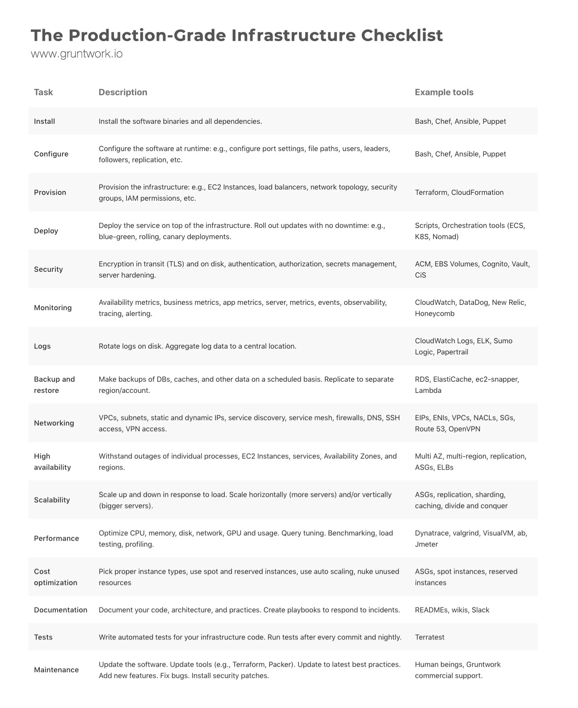

Sometimes it feels that it takes more time setting up the infrastructure of an application that actually writing the application code.

The following infographic from [gruntwork](https://blog.gruntwork.io/5-lessons-learned-from-writing-over-300-000-lines-of-infrastructure-code-36ba7fadeac1) nicely illustrates this by showing the breath of tasks one needs to undertake to get a production-grade infrastructure running:

