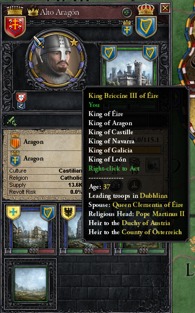

---
authors:
- max
blog: maxrohde.com
categories:
- games
coverImage: world.png
date: "2019-05-26"
tags:
- crusader-kings
- crusader-kings-2
- experiences
- gaming
title: What I have Learned from Crusader Kings 2
---

We often find ourselves in discussions if activities such as reading, watching TV, browsing the Internet or playing video games are good for you or not. I think this is like asking if a government is a good thing or not. The question is for the most part pointless since it doesn't matter so much if we do have a government or not but what kind of government it is.

The same is true for reading. You can read hundreds of books and not enrich your life by a penny. Conversely, just reading one book might change your life forever. The same principle applies to playing computer games. Like any form of art, they are very varied and some games might provide us with more benefits than others.

Recently I spent some time playing the game Crusader Kings 2. Personally I found this to be quite an enriching experience. I am certain not everyone will feel this way - but for me it was true. Here I want to list some of the things I have learned while playing this game:

## One Life Doesn't Amount to Much

In Crusader Kings 2 you follow the path of a dynasty in Medieval Europe. The game does not end when your character dies but when a certain date is reached or your whole dynasty has become extinct. That notwithstanding you always play as one particular character. When that character dies, you start playing as another one (your son or daughter, for instance).

By the end of the game, you might have played as dozens of different characters. One starts to understand that history is not shaped by any one life but by many. Even if one manages to achieve the most outstanding in one lifetime, it will only be a drop in the ocean of history. Moreover, no matter the achievement, one is always sure to perish.

## A Deeper Understanding of the Political System in Medieval Europe

I always thought of medieval Europe as a kind of Wild West where the law of the strongest ruled supreme. However, playing Crusader Kings 2 made me realise that the political system governing Europe was in fact very static and rule based.

For instance, even if one has a stronger army than rulers in all surrounding territories, one cannot simply conquer them. It is only possible to invade other territories when one has a valid 'casus belli' - a justification for war. For instance, if my brother inherits the kingdom of England and I get nothing, well, I will have a valid reason to claim the throne for myself.

With a powerful army and no valid justification for war, power cannot be expanded. Likewise a valid justification without a powerful army will not yield any advantage. Only the combination of the two provides the necessary means to overpower ones opponents.

## Power is Always a Balancing Act

A very important concept of the games is the management of vassals. For instance, a king might rule multiple dukes, which in turn rule over multiple counts. Vassals will provide their ruler with an army levy and/or taxes. The more powerful a vassal is, the more soldiers and income they provide.

However, as useful as powerful vassals can be, as dangerous they can be as well. Vassals will band together and demand laws more favourable to them or even demand independence from your benevolent rule.

This teaches that power is seldom absolute. You need to be able to rely on others to exercise power in a larger scale.

## You Might Loose Even While You are Winning

Starting from a single county in Ireland, I managed to build up a sizeable realm consisting of multiple kingdoms (Ireland, Navarra, Aragon, Asturias, Galicia, Leon) and was about to take control over the remainder of Spain. I had built up a bank of over 4000 gold pieces and vassals which were too weak to oppose me but strong enough to bolster the aspiring empire. As luck would have it, I only had two daughters. In this game, that is bad news.

I had manged with much scheming and trickery to change the succession laws in all of the kingdoms I ruled to primogeniture, which should assure that all kingdoms would pass on to my oldest son, and in absence of such, to my oldest daughter. However, upon my death, either through a bug in the game or arcane medieval laws, my oldest daughter received one kingdom, and my youngest daughter all the others. The character I took control over was my oldest daughter, and thus, in an instant the aspiring empire I had built was lost.

\[caption id="attachment_149" align="alignnone" width="387"\] My character's titles before the downfall\[/caption\]

This taught me the lesson that even if things are going very well, one must not start to be careless, unless one risks to loose everything.

When we think of computer gaming, we often think of first person shooters or adventure games. Aimed with the power of a controller, the player obliterates scores of enemies. While there is something to be learned from such games as well, specifically hand-eye coordination and systems thinking, there are many other types of games which can deliver their own rich experiences. I found Crusader Kings 2 to be such a game. While I have listed here what I have learned from it, I would encourage anyone to give this game a try; since the real power of games comes from their interactivity; in which they are able to teach us lessons words on a page never could.