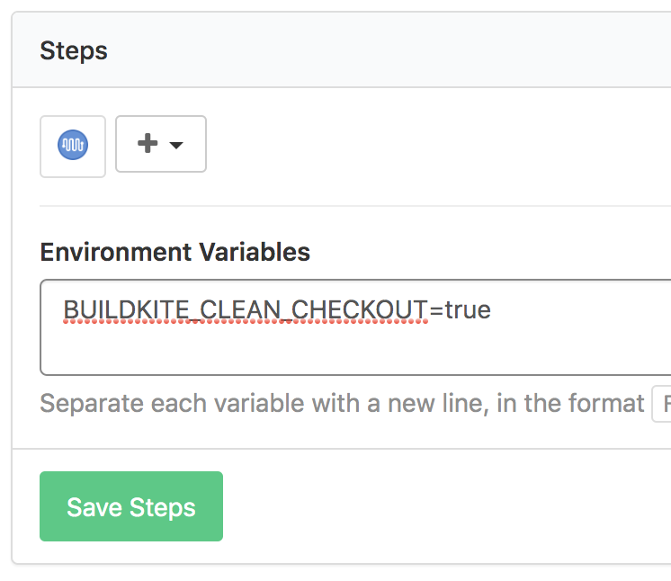

[Buildkite](https://buildkite.com/) is a great tool for running multi-step build and deployment pipelines. [Lerna](https://github.com/lerna/lerna) is a tool for managing multiple JavaScript packages within one git repository.

Given that both Lerna and Buildkite are quite popular, it is surprising how difficult it is to set up a basic build and deployment with these tools.

It is very easy to configure a deployment pipeline in Buildkite that will run every time a new commit has been made to a git branch. However, using Lerna, we want to build only those packages in a repository that have actually changed, rather than building all packages in the repository.

Lerna provides some build in tooling for this, chiefly the `ls` command which will provide us a list of all the packages defined in the monorepo. Using the [\--since](https://github.com/lerna/lerna/tree/master/core/filter-options#--since-ref) filter with this command, we can easily determine all packages that have changed since the last commit as follows:

```
lerna ls --json --since HEAD^
```

Where `^HEAD` is the git reference to the commit proceeding `HEAD`. The `--json` flag provides us with an output that is a bit easier to parse, for instance using [jq](https://stedolan.github.io/jq/).

However, in a CD environment, we usually build not only when a new merge to master has occurred but also when changes to a branch have been submitted. In that instance, we are not interested in the changes which occurred since the last commit but all the changes that have been made in the branch in comparison to the current master branch.

In this instance, the `lerna ls` command with a `--since` filter can help us when comparing the current branch with master.

```
lerna ls --json --since refs/heads/master
```

Internally, Lerna would run a command such as the following:

```
git --no-pager diff --name-only refs/heads/master..refs/remotes/origin/$BUILDKITE_BRANCH
```

This diff goes both ways, so when a file is changed in a package in master only or the branch only, it will cause the package to be listed among the packages to be build. We are only interested in those packages however that are changed in the branch. This can be somewhat assured by running a `git pull` before the `lerna ls` command:

```
git pull --no-edit origin master
lerna ls --json --since refs/heads/master
```

Unfortunately Buildkite by default does something of a 'lazy clone' of the repository. It will only ensure that the branch that is currently being built is checked out with the latest commit and other branches, including master, might be cached from previous builds and are on an old commit. This will prevent the above approach for building branches from working. Thankfully there is an [environment variable](https://buildkite.com/docs/pipelines/environment-variables) in Buildkite we can use to force it to get the latest commit for all branches: `BUILDKITE_CLEAN_CHECKOUT=true`.



Having this list of packages that have changed, we can then trigger pipelines specific to building the changed packages. This can be accomplished using a [trigger step](https://buildkite.com/docs/pipelines/trigger-step).

```
- trigger: "[name of pipeline for package x]"
  label: ":rocket: Trigger: Build for package x"
  async: false
  build:
    message: "${BUILDKITE_MESSAGE}"
    commit: "${BUILDKITE_COMMIT}"
    branch: "${BUILDKITE_BRANCH}"
```

Another way to go about deploying with Lerna might be using [lerna publish](https://github.com/lerna/lerna/tree/master/commands/publish) where we could push npm packages to an npm registry and then trigger builds from there. I haven't tested this way and I think this would require a private npm registry, which the way outlined in this article would not.

If anyone has a more elegant way to go about orchestrating the builds of packages in a Lerna repository, please let everyone know in the comments.
