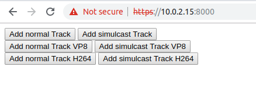
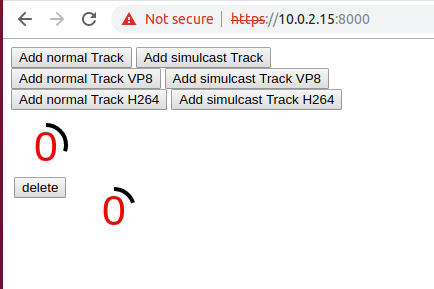

I've recently done some research into [WebRTC](https://webrtc.org/) and specifically on how to stream media captured in the browser to a server. Initially I thought I could use something like [Kinesis Video Streams](https://aws.amazon.com/kinesis/video-streams/) and have AWS do the heavy lifting for me. Unfortunately this turned out way more complicated than I had anticipated so I started looking for other options.

That is when I came across Media Servers such as [Medooze](http://www.medooze.com/), [OpenVidu](https://openvidu.io/), [Janus](https://janus.conf.meetecho.com/index.html) and [Jitsi](https://jitsi.org/). Medooze caught my attention since it appears to [scale very well](https://uploads-ssl.webflow.com/5c6853c495409838d874a0d2/5cbed66cae2b88609106befa_IPTComm_2018_LoadTesting-12%5B23229%5D.pdf) and offers a [NodeJS based server](https://github.com/medooze/media-server-node).

It did take me some time to find a meaningful demo for Medooze and then to get it running. So I thought I briefly document the steps here to get a demo for Medooze up and running (note this only works on Linux or Mac OS X):

1. Head over to the [media-server-client-js](https://github.com/medooze/media-server-client-js) project and clone it.
2. Run the following commands:

```bash
npm i
npm run-script dist
cd demo
npm i
```

3. Get the IP address of your current machine:

```bash
ifconfig | grep "inet "
```

4. Using this IP, launch the Medooze server in the `demo` directory:

```
node index.js [your IP]
```

5. Head to a browser and open the URL `https://[your ip]:8000` (for instance `https://10.0.2.15:8000`. Accept the SSL certificate for your localhost.

You should now see the demo page:



Clicking the buttons will create video streams:



The animation on top of the remote button is a video stream taken from a local canvas and animation/video to the right is the same stream relayed through the server.

So the client sends a stream to the server, the server sends that stream right back and the client then renders that stream.

During my local testing I encountered an issue when adding tracks with codecs (VP8, H264) that I have filed and link here for reference: [Adding tracks with Codecs does not work](https://github.com/medooze/media-server-client-js/issues/5)
