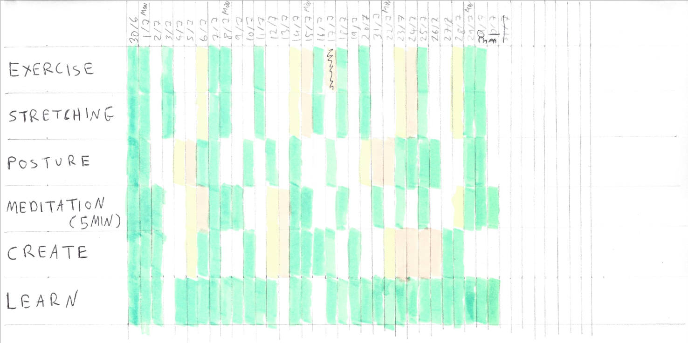

---
authors:
- max
blog: maxrohde.com
categories:
- psychology
coverImage: writing-828911.jpg
date: "2019-08-03"
tags:
- habit
- habits
- life
- productivity
- system
title: Simple Habit Tracking System
---

I have long been looking for a system that helps me stick to good habits. I used a [time tracking application](http://timetrack.io/) on my iPhone and also created various spreadsheets. Unfortunately the solutions I found so far turned out to be too cumbersome to enter data (spreadsheets) or too difficult to run reports on (time tracking apps).

I've recently read the book [Joy, Inc. by Richard Sheridan](https://www.goodreads.com/review/show/2921675953) and one of the interesting points discussed was that the profiled company uses pen, paper and cardboard cards to plan, design and track their work. This gave me the idea that I could try to create a paper-based system to track my success in sticking to a number of habits.

This is the system that I came up with:

- Create a table where the columns are the days in a month and the rows represent different habits
- If a habit was successfully practised in a day, mark the corresponding cell as **green**.
- If a habit has not been practised in three days, mark the cell corresponding to the third day **yellow**.
- If a habit has not been practices for four days or longer, mark all days after the third as **red**.

For the first month, July 2019, I decided to track the following habits:

- **Exercise**: Any form of exercise done during the day (just being active, such as walking or taking the bike does not count)
- **Stretching**: Any form of stretching
- **Posture**: Any attempt made by me during the day to correct and improve my posture
- **Meditation**: Mediate for at least five minutes
- **Create**: Work on some form of artifact, such as a piece of writing or code
- **Learn**: Spend some time learning to touch type and/or to draw

This is how I tracked for each one of them:

It seems that I have some way to go until I practise all the habits I have set out to do daily. However I have also not completely failed at any of the habits and were able to practice them in 30-50% of the days of the last month. I am particularly pleased at my progress for the Learn habit. I was able to improve my proficiency for typing some tricky constructs required for programming quite significantly. Unfortunately I don't think I have gotten any better at drawing.

Overall I quite liked this system, it was easy to follow and provided me with a good overview of how I was tracking day by day as well as for the month overall. For the next month, I will follow a slightly modified version with a changed set of habits.

Picture credit: [Free-Photos](https://pixabay.com/photos/writing-write-person-paperwork-828911/)
