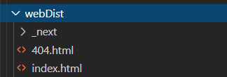

[Next.js](https://nextjs.org/) is becoming ever more popular these days and rightfully so. It is an extremely powerful and well-made framework that provides some very useful abstractions for developing React applications.

An easy way to deploy Next.js application is through using [Vercel](https://vercel.com/). However, it can also be useful to deploy Next.js application into other environments to simplify governance and billing. One popular way to to deploy frontend applications is through using the AWS services S3 and CloudFront.

This article describes how to set up the infrastructure required for running a Next.js application using Terraform on AWS, and some of the gotchas to keep in mind. You can also [check out the code on GitHub](https://github.com/goldstack/nextjs-example#goldstack-sample-nextjs-project).

### Build Project

There are [numerous ways to deploy a Next.js application](https://nextjs.org/docs/deployment). In our case, we will need to deploy our application as [static website](https://nextjs.org/docs/advanced-features/static-html-export).

For this, we will need to define the following script.

```javascript
"scripts": {
  "build:next": "next build && next export -o webDist/"
}
```

Running this script will output a bundled, stand-alone version of the Next.js application that can be deployed on any webserver that can host static files.



### S3

We will need an S3 bucket to store the files resulting from the Next.js build process. This essentially is just a public S3 bucket.

Below the Terraform for generating such a bucket using the [aws\_s3\_bucket](https://registry.terraform.io/providers/hashicorp/aws/latest/docs/resources/s3_bucket) resource. Note here:

- The permissions for public read are set by `acl = "public-read"` but we also need a public read bucket policy that is defined
- The `index_document` and `error_document` correspond to those output in the previous step.

```
resource "aws_s3_bucket" "website_root" {
  bucket = "${var.website_domain}-root"

  acl = "public-read"

  # Remove this line if you want to prevent accidential deletion of bucket
  force_destroy = true

  website {
    index_document = "index.html"
    error_document = "404.html"
  }

  tags = {
    ManagedBy = "terraform"
    Changed   = formatdate("YYYY-MM-DD hh:mm ZZZ", timestamp())
  }

  policy = <<EOF
{
  "Version": "2008-10-17",
  "Statement": [
    {
      "Sid": "PublicReadForGetBucketObjects",
      "Effect": "Allow",
      "Principal": {
        "AWS": "*"
      },
      "Action": "s3:GetObject",
      "Resource": "arn:aws:s3:::${var.website_domain}-root/*"
    }
  ]
}
EOF

  lifecycle {
    ignore_changes = [tags]
  }
}
```

Next we need to be able to upload our files to this S3 bucket. There are many ways to do this, for instance using the [AWS CLI](https://aws.amazon.com/cli/). I have also created an open source package that provides an integrated package for handling the upload of the files (plus setting up infrastructure through Terraform): [template-nextjs](https://www.npmjs.com/package/@goldstack/template-nextjs). This library will also be used when you choose to create a starter project on [Goldstack](https://goldstack.party).

One thing to keep in mind when uploading website resources to S3 is that we want to avoid errors on the user's end during the deployment process. We for instance do not want to delete the files before we re-upload them, since this may result in a small window in which the files are unavailable for users.

This can be solved by uploading the new files first using the AWS [S3 sync command](https://awscli.amazonaws.com/v2/documentation/api/latest/reference/s3/sync.html) and then uploading them a second time with the `--delete` flag. The resulting commands will look somewhat like this:

```bash
aws s3 sync . s3://[bucketname]/[path]
aws s3 sync . s3://[bucketname]/[path] --delete
```

Since Next.js in general generates hashed file names, you could also just keep all old files on the bucket. However, Next.js deployments can quickly become large (> 50 MB), so depending on how often you deploy, this could quickly result in a significant amount of unnecessary data stored in your S3 bucket.

See here for reference as well the utility used by the \`template-nextjs' package above: [utilsS3Deployment](https://github.com/goldstack/goldstack-lib/blob/master/packages/utils-s3-deployment/src/utilsS3Deployment.ts).

### CloudFront

While it is possible to use an S3 bucket by itself to host a static website, it is usually preferrable to also use a [CloudFront distribution](https://docs.aws.amazon.com/AmazonCloudFront/latest/DeveloperGuide/distribution-working-with.html) in front of the bucket. This results in significantly faster load times for the user, and also enables us make our website available through a secure `https://` link.

There are quite a few moving pieces involved in setting up a CloudFront distribution, so the best reference point here will be the complete Terraform availabe in the [example project](https://github.com/goldstack/nextjs-example/blob/master/packages/app-nextjs/infra/aws/root.tf) on GitHub. However, I will put a few excerpts from the Terraform configuration below.

We first need to configure an origin that points to our S3 bucket defined earlier:

```
  origin {
    domain_name = aws_s3_bucket.website_root.website_endpoint

    origin_id   = "origin-bucket-${aws_s3_bucket.website_root.id}"
    
    custom_origin_config {
      http_port = 80
      https_port = 443
      origin_protocol_policy = "http-only"
      origin_ssl_protocols = ["TLSv1.2"]
    }
  }
```

And specify a root object that matches the index of our page:

```
  default_root_object = "index.html"
```

Then we need to set up the cache settings for CloudFront. A Next.js application consists of some files that should be loaded fresh by the user on every page load (e.g. `index.html`) but most files should only be downloaded once, and then can be cached safely. These pages can also be cached on CloudFront's edge locations. This can be achieved in CloudFront using [cache behaviours](https://docs.aws.amazon.com/cloudfront/latest/APIReference/API_CacheBehavior.html).

```
  # Priority 0
  ordered_cache_behavior {
    path_pattern     = "_next/static/*"
    allowed_methods  = ["GET", "HEAD", "OPTIONS"]
    cached_methods   = ["GET", "HEAD", "OPTIONS"]
    target_origin_id = "origin-bucket-${aws_s3_bucket.website_root.id}"

    forwarded_values {
      query_string = false
      headers      = ["Origin"]

      cookies {
        forward = "none"
      }
    }

    min_ttl                = 0
    default_ttl            = 86400
    max_ttl                = 31536000
    compress               = true
    viewer_protocol_policy = "redirect-to-https"
  }
```

We can also configure CloudFront to service the correct 404 page provided by Next.js:

```
  custom_error_response {
    error_caching_min_ttl = 60
    error_code            = 404
    response_page_path    = "/404.html"
    response_code         = 404
  }
```

Finally, we can link the CloudFront distribution with an AWS provided SSL certificate (free). There is more involved to that than the following - for more information, please have a browse around the source files.

```
  custom_error_response {
    error_caching_min_ttl = 60
    error_code            = 404
    response_page_path    = "/404.html"
    response_code         = 404
  }
```

In the example project, we also configure two CloudFront distributions. One to serve the main website, and one to allow forwarding users from an alternate domain. So if a user would go to the domain `https://www.yourcompany.com`, they can be forwarded to `https://yourcompany.com`. You can find the configuration for that here [redirect.tf](https://github.com/goldstack/nextjs-example/blob/master/packages/app-nextjs/infra/aws/redirect.tf).

### Route53

Lastly we need to be able to link our CloudFront distribtuion to a domain, and for this we can use the Route 53 service on AWS. This service works both for domains purchased on AWS and for domains purchased through another domain provider.

This can be defined in Terraform easily:

```
# Creates the DNS record to point on the main CloudFront distribution ID
resource "aws_route53_record" "website_cdn_root_record" {
  zone_id = data.aws_route53_zone.main.zone_id
  name    = var.website_domain
  type    = "A"

  alias {
    name                   = aws_cloudfront_distribution.website_cdn_root.domain_name
    zone_id                = aws_cloudfront_distribution.website_cdn_root.hosted_zone_id
    evaluate_target_health = false
  }
}
```

The example project assumes that a Route 53 hosted zone is already configured for the domain you would like to deploy your application to. You can find instructions how to achieve that in the [Goldstack documentation](https://docs.goldstack.party/docs/goldstack/configuration#hosted-zone-configuration).

### Gotchas

When deploying a Next.js application to AWS using the method described in this post, there are a few gotchas we need to keep in mind.

Chiefly, this deployment will not support any Next.js [API routes](https://nextjs.org/docs/api-routes/introduction) and server-side rendering. There are ways to provide some support for these, and there is a good [Serverless module](https://www.serverless.com/blog/serverless-nextjs) for that. However, things can quickly become complicated, so I would recommend to instead deploy an API separately using Lambdas. Goldstack projects make that easy by allowing to define the Next.js application and lambdas for providing the API [in one monorepo](https://docs.goldstack.party/docs/goldstack/about#modularity-first).

There are further some issues related to pre-fetching pages in some cases. These can be avoided by not using the Next.js `<Link>` component.

## Final Thoughts

If you are looking for a fully integrated experience for deploying Next.js applications and you do not worry too much about costs and system governance I would recommend deploying to [Vercel](https://vercel.com/). You can still use the Goldstack Next.js templates if you are interested in that (see [Vercel Deployment](https://docs.goldstack.party/docs/modules/app-nextjs-bootstrap#vercel-deployment-1)).

However, there are some benefits in being able to have your entire infrastructure defined in one cloud provider, and hosting a Next.js website on AWS is very cost effective and provides a good experience for users. Also, AWS has a great reputation for service uptime, especially for the services involved in hosting this solution (S3, CloudFront, Route 53).

Feel free to [clone the sample project on GitHub](https://github.com/goldstack/nextjs-example) or be welcome to check out [Goldstack](https://goldstack.party/templates/nextjs) which provides an easy UI tool to configure your Next.js project (plus link it to additional services such as email sending and data storage on S3).
