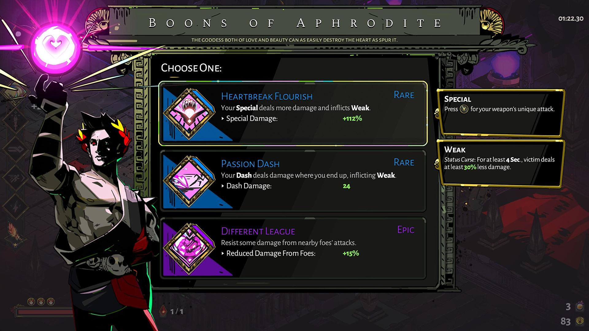
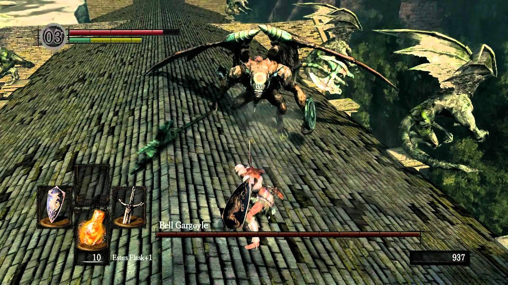
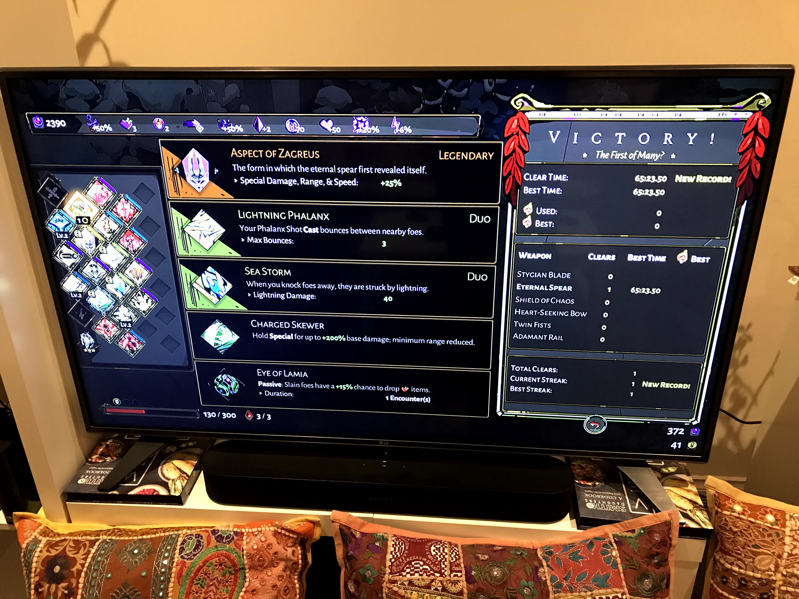

---
authors:
- max
blog: maxrohde.com
categories:
- games
coverImage: hades.jpg
date: "2021-06-04"
tags:
- difficulty
- gaming
- hades
- randomness
- review
- risk
title: A Discussion of Hades, the Videogame
---

I am not very good at playing video games; I never played any games with a controller as a child and thus never got very good at using them. Somehow I still enjoy difficult games the most. I (unsuccessfully) played the games [Dark Souls](https://en.wikipedia.org/wiki/Dark_Souls) ('Prepare to Die Edition') and (somewhat more successful) [Dead Cells](https://en.wikipedia.org/wiki/Dead_Cells) both known to be punishingly difficult. Although these games made me fail constantly, I spent a lot more time with them than with other games with a more forgiving difficulty curve, such as Assassins Creed. Recently I managed to complete one run-through of [Hades](<https://en.wikipedia.org/wiki/Hades_(video_game)>), a game that also made me struggle quite a bit. I think Hades is really a brilliantly designed game, so I wanted to take some time to reflect upon the elements I think that make this game so enticing.

## About the Game

Before starting to discuss the elements of the game, I will give a brief background of what the game Hades is about. You play the character of Zagreus, son of Hades, the Greek god of the dead and king of the underworld. Zagreus, of teenage age, decides to leave his home, the court of Hades and try to venture to the land of the living. This involves ascending from the court of Hades through several different levels of the underworld. During his ascend, Zagreus has to fight opponents in a succession of rooms. Controlled by a moderately skilled player such as me, Zagreus is bound to die many times in this attempt. Death will bring Zagreus back to his father's court and he has to start the journey anew.

## Randomness

Let's face it: Life is random. We may make ourselves believe that we have everything under control; but to a large degree, what job you get, how your investments are doing and who your friends are comes down to the inscrutable weavings of the fates. Generally I am not a friend of randomness in games, and the dice is sure to get my blood boiling quickly. I sure can understand why someone would like to make a companion application to the board game [Catan](https://en.wikipedia.org/wiki/Catan) that will ensure a fair distribution of dice rolls ([Catan Dice](https://play.google.com/store/apps/details?id=com.shirbi.catandice&hl=en_AU&gl=US)).

Hades is a game that relies to a large degree on randomness. During the ascend through the underworld, Zagreus will receive boons from the Olympian gods. These boons give Zagreus additional abilities that make the game easier. Which gods he receives boons from and what boons he receives is random. In one escape attempt, Zagreus may receive a boon from Zeus that will turn his attack into a bolt of lightning, or his attack may be enhanced by a boon from Aphrodite that will give give his opponents weak knees, thus reducing the ferocity of their attacks.

The result of this is that in some escape attempt Zagreus receives a very strong combination of boons, and in other's weaker ones. Thus, the difficulty in every escape attempt will be different. This may be a bit frustrating when trying to escape with a weak combination of boons, but ultimately I think this enhances the game, since it forces the player to try out different strategies for every attempt, to maximise the advantage of what they have received.

Key to what makes this successful is I think both variety and impact. Variety means that there are many different boons, and even more combinations of boons. Impact means that different boons have noticeable and significant effect on the gameplay. Both variety and impact are provided in Hades, since there are many boons and they significantly alter the way the game is played.

## Risk and Reward

Like randomness, the fundamental calculation of risk and reward is something we all encounter in life. Investing in a start up can result in higher returns than investing in government bonds (but likewise may result in a greater loss). Finding a new job may bring you more job satisfaction and pay, or give you a more stressful work life.

Hades also includes many elements of risk a and reward. Some of the rooms that Zagreus has to fight through in his ascend contain _Treasure Troves_. Opening these will result in an additional fight that may lead to Zagreus' death or give a useful reward. Special boons can be received from _Primordial Chaos_, that will weaken Zagreus for a while and afterwards, when Zagreus survives, provide significant bonuses.

What I find especially interesting here is that calculations of risk and reward in Hades are not only short term decisions but are decisions with long-term strategic impact. Taking risks early in an escape attempt can ensure encounters later in the game are easier. I think that is a good reflection on how we can look at risk and reward in life as well. If we seek risk for short-term reward, we are more often than not disappointed and our lives may become more stressful, such as when day trading. If we seek risk for long-term reward, often the consequences become more tolerable and the payoff can be more significant.

## Getting Good

We play games for enjoyment, it may therefore be counterintuitive how a game that confronts us with constant failure - which generally is not very enjoyable - can be a good game. I think the explanation for this lies less in the difficulty itself but in that difficulty offers an opportunity for improvement. If something is easy and we are not challenged, there is no reason for us to get better.

Hades is organised into a series of rooms. In each room, the player either fights enemies or interacts with non-player characters. In my first escape attempt, I barely made it through a handful of rooms. Eventually, as I learned more about the weapons I was using and the enemy behaviours, I was able to get through more and more rooms. Of course, the aforementioned randomness also influenced how far I would be able to get, based on the usefulness on the boons received from the Olympians. In addition, after each death, Zagreus can invest resources found in the last escape attempt to upgrade his combat abilities and weapons. This makes future attempts easier (the game also scales up difficulty of your opponents though). Notwithstanding these effects, key to being able to escape successfully is the player's skill.

I think in order for a game to give us enjoyment from getting better, it needs to offer a somewhat gradual progression, allow us to focus on the skills we need to improve and avoid too much repetition (note, for real life excellence in competitive sports one definitely should not be afraid of excessive repetition, see my review of [The Art of Learning](https://spearoflight.wordpress.com/2021/05/08/book-review-the-art-of-learning/)). I stopped playing Dark Souls since the second or third boss level enemy (some flying thing on a roof) was just too much for me to handle, and I would die over and over again. After each death, I would have to slog through a whole area of the game, with enemies I could defeat easily, only then to be mercilessly crushed by the boss. The increase in difficulty was too steep for me, I was not able to dedicate my time to the skills I needed to get better at (fighting the boss), and instead needed to do the same thing over and over again (clear the level with easy enemies).

Since I am not very good (or interested in) learning the attack patterns of enemies, I am often not very successful at fighting video game bosses, and thus also struggled with the ones in Hades. However, in Hades, I was able to develop a strategy that would help me overcome my weakness; always try to invest in skills that will help me in fighting bosses. Also after two or three attempts I would usually be able to defeat the boss. Hades also keeps things interesting by creating variety in the rooms one has to clear before encountering bosses.

Thus I think Hades is really an example of a game that balances difficulty with progress very well; constantly challenging the player to get better, but ensuring that getting better is fun - and does not take too long.

## Conclusion

Humans are not the only animals who play. Many mammals engage in play, especially when they are young. Playing though seems like the ultimate waste of time - why would nature program us to do it? The answer here is manifold but some of the important elements of play are that it allows practicing skills in a safe environment. Thus games that are grounded in the challenges of real life can be argued to be the most natural and useful for us.

However, our desire to play I believe is not without fault and can easily be exploited. There is a slippery slope between games that can entertain us, while also being able to help us learn and grow. Games can teach us by helping us understand new knowledge in a systematic way (see [What I Have Learned from Crusader Kings 2](https://spearoflight.wordpress.com/2019/05/26/what-i-have-learned-from-crusader-kings-2/) and [What I Have Learned from Frostpunk](https://spearoflight.wordpress.com/2020/04/10/what-ive-learned-from-frostpunk/)) but also in a more abstract way, by helping us internalise and develop strategies for fundamentals of life such as randomness, risk and reward and dealing with difficulty. But we can also get lost in games, doing the same repetitive thing over and over without much benefit to us.

Hades I believe is a game that is masterfully designed to be entertaining but is also rewarding and can help equip us for some life challenges. But due to its masterful design, it also poses a danger to us, to spent more time with it than may be to our benefit. Ultimately, I can recommend anyone to give Hades a try, and if it is too difficult, to try and stick with it, and complete an escape attempt at least once.

