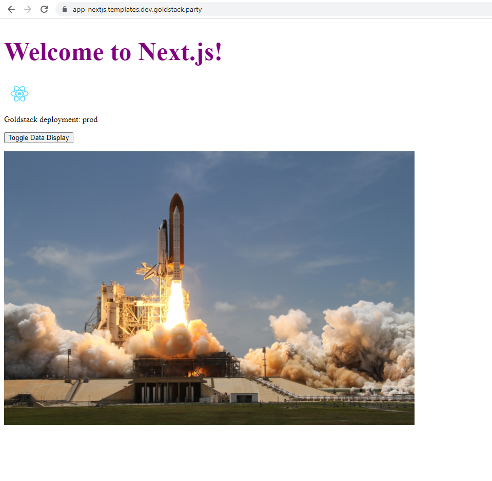

[Next.js 11](https://nextjs.org/blog/next-11) includes an exciting new feature for dynamically optimising images using the [<Image>](https://nextjs.org/docs/api-reference/next/image) tag. Unfortunately, this new feature [does not play nicely](https://github.com/vercel/next.js/issues/18356) with exporting a static version of the Next.js app using `yarn next export` by its very design. This is not great for serverless deployments, which often will rely on uploading the static version of web applications to a service like S3 (see [my guide of how to that here](https://maxrohde.com/2021/01/30/deploy-next-js-to-aws/)).

The following provides a **simple solution** for getting the export working again for your serverless projects. There are more sophisticated solutions that involve custom loaders that allow taking advantage of all the fancy features of Next.js image optimisation, however we are opting here for something simple that will ensure your app still works with a simple static deployment in an S3 bucket.

Here the steps we need to take. All of the following assumes that you are using **Next.js 11** for your application.

- Add the [next-optimized-images](https://github.com/cyrilwanner/next-optimized-images) package to your project (along with some additional dependencies it needs)

```bash
yarn add next-optimized-images file-loader img-loader url-loader ignore-loader extracted-loader next-compose-plugins
```

- Import this into the [next.config.js](https://nextjs.org/docs/api-reference/next.config.js/introduction) of your project

```javascript
const optimizedImages = require('next-optimized-images');
```

- Also in your `next.config.js` disable static image rendering as well as initialise the `next-optimized-images` plugin.

```
const nextConfig = {
  images: {
    disableStaticImages: true,
  },
};

const config = withPlugins(
  [
    [
      optimizedImages,
      {
        // optimisation disabled by default, to enable check https://github.com/cyrilwanner/next-optimized-images
        optimizeImages: false,
      },
    ],
  ],
  nextConfig
);
```

Also find a complete [next.config.js file here](https://github.com/goldstack/goldstack/blob/master/workspaces/templates/packages/app-nextjs/next.config.js).

- If you are using TypeScript, add the image file types as known modules in a `index.d.ts` file in your `src/` folder:

```typescript
declare module '*.svg' {
  const content: any;
  export default content;
}

declare module '*.png' {
  const content: any;
  export default content;
}

declare module '*.jpg' {
  const content: any;
  export default content;
}

declare module '*.jpeg' {
  const content: any;
  export default content;
}

declare module '*.gif' {
  const content: any;
  export default content;
}
```

Now you are ready to run `next export` and your images should be included. Small images will be embedded as base64 encoded image directly in your pages and larger images will be copied into a `public/static` folder. To see an app rendered in this way see [app-next-js](https://app-nextjs.templates.dev.goldstack.party/).



See a completely configured project here: [app-next-js](https://github.com/goldstack/goldstack/tree/master/workspaces/templates/packages/app-nextjs).

If you are starting a new project, you can also use the [Goldstack Next.js](https://goldstack.party/templates/nextjs) or [Goldstack Next.js + Bootstrap](https://goldstack.party/templates/nextjs-bootstrap) templates, which are end-to-end configured for deploying a Next.js application in a serverless way to AWS.
