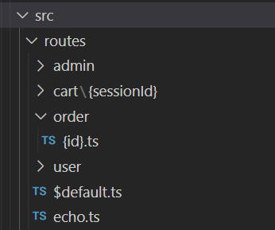
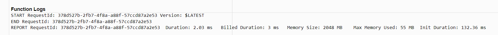

---
categories:
- devops
- javascript
coverImage: serverless-api-architecture.png
date: "2022-01-04"
blog: maxrohde.com
tags:
- aws
- coding
- programming
- rest
- serverless
- terraform
- tutorial
- typescript
title: Serverless API with TypeScript on AWS
---

There are many ways to stand up a REST API. Nearly every programming language provides a way for us to develop a simple web server, such as [Express.js](https://dev.to/geekygeeky/get-started-with-es6-javascript-for-writing-nodejs-using-express-544h), [Go Gin](https://dev.to/21yunbox/how-to-deploy-go-gin-to-a-server-36d) or [Python Flask](https://dev.to/sm0ke/flask-bootstrap-templates-open-source-and-free-m2b). However, with the [advent of serverless computing](https://medium.com/@chakrabartis/server-less-eats-the-infrastructure-2a3d0ef66363), we need to rethink some of the fundamentals of how APIs are developed and deployed. Chiefly:

- Traditionally APIs are packaged into one deliverable; serverless architecture encourages to divide solutions up into many smaller units that are packaged and deployed individually.
- Traditionally APIs are stateful applications that are started and stopped infrequently; serverless architecture encourages to start up compute tasks only on demand.

In this article, I will describe a way to develop a serverless API in TypeScript. The motivation is to develop a solution that makes it very easy to get started - making compromises as required to not over-complicate the solution. Specifically, this TypeScript API will:

- Use [AWS HTTP Gateway](https://aws.amazon.com/blogs/compute/announcing-http-apis-for-amazon-api-gateway/) to route HTTP requests to AWS Lambda functions
- Develop handlers for HTTP routes in TypeScript
- Deploy every handler in a separate Lambda for minimal cold-start times
- Generate configuration for the API Gateway automatically by mapping `.ts` files in a `src/routes` folder to HTTP routes
- Have all infrastructure defined in Terraform for easy extensibility and configuration

While it is actually quite quick to stand up an API using the techniques and template described in this article, there are a few moving parts involved in making a Serverless API work end-to-end. Therefore I will go through some background concepts in this article, to explain the different components of the solution.

## TL;DR

If you just want to get a working API up and running and start coding your endpoints, I have put together and easy to use template. Feel free to download that template to get started:

[🔗 Goldstack Serverless API Template](https://goldstack.party/templates/serverless-api)

You can also explore the source code a complete project set up for the domain [`typescript-serverless-api.examples.dev.goldstack.party`](https://typescript-serverless-api.examples.dev.goldstack.party) and adapt this to your needs:

[🔗 GitHub TypeScript Serverless API Template](https://github.com/mxro/typescript-serverless-api)

## Overall Architecture

Let us start with a high level view of the solution:


_Clients_ such as mobile application or browser applications make HTTP request to an endpoint provided by the _AWS API Gateway_. This will be available under a domain such as `api.mywebsite.com`.

API Gateway defines a number of routes; e.g. `/user` or `/message` that clients can access via the API domain, e.g. `https://api.mywebsite.com/user`.

When HTTP requests for these endpoints are received, API Gateway will invoke _Lambda functions_ for these endpoints. Each endpoint will have its own Lambda function. The Lambda functions will contain a _handler_ defined in TypeScript. In this handler, we define the logic that will determine what response the server will provide.

In the following, I will provide further details for each of the components of the architecture.

## AWS API Gateway HTTP API

For our solution we use the [AWS API Gateway HTTP APIs](https://advancedweb.hu/how-to-use-the-aws-apigatewayv2-api-to-add-an-http-api-to-a-lambda-function/) and not the original AWS API Gateway REST API. The latter requires a lot more complex configuration and the new HTTP API does the job just fine for our purposes. To find out more about the differences between the HTTP API and the REST API, please see this page on the AWS documentation:

[🔗 Choosing between HTTP APIs and REST APIs](https://docs.aws.amazon.com/apigateway/latest/developerguide/http-api-vs-rest.html)

Unfortunately the HTTP API has a very generic name that makes it [difficult to search for](https://advancedweb.hu/how-to-use-the-aws-apigatewayv2-api-to-add-an-http-api-to-a-lambda-function/#troubleshooting).

Thus I would recommend to bookmark the following reference pages for digging deeper into any concepts touched upon here:

- [AWS Developer Guide: Working with HTTP APIs](https://docs.aws.amazon.com/apigateway/latest/developerguide/http-api.html)
- [Terraform API Gateway v2 Reference](https://registry.terraform.io/providers/hashicorp/aws/latest/docs/resources/apigatewayv2_api)

The HTTP API for our solution provides the following features:

- Provide us with a public HTTP endpoint that clients can call
- Route requests to Lambdas based on the request path

Defining an API Gateway using Terraform is actually quite simple, see [api_gateway.tf](https://github.com/mxro/typescript-serverless-api/blob/master/packages/lambda-api/infra/aws/api_gateway.tf):

```hcl
resource "aws_apigatewayv2_api" "api" {
  name        = "lambda-api-gateway-${random_id.id.hex}"
  description = "API for Goldstack lambda deployment"
	protocol_type = "HTTP"
}
```

AWS generates HTTP endpoints for all HTTP APIs automatically. These use domains such as `d58z7h24p0.execute-api.us-west-2.amazonaws.com`. In most instances, we would want to replace this with our own custom domain names for instance `api.mydomain.com`. For this we need to configure [AWS Route 53](https://dev.to/gregfullard/learn-aws-with-me-episode-4-route-53-4aml). The first thing we will need is a hosted zone. Please see this guide to see how to set up a hosted zone: [Hosted Zone Configuration](https://docs.goldstack.party/docs/goldstack/configuration#hosted-zone-configuration).

Once we have the id of our hosted zone, we can define an A alias to our API Gateway [domain.tf#L47](https://github.com/mxro/typescript-serverless-api/blob/master/packages/lambda-api/infra/aws/domain.tf#L47):

```hcl
resource aws_route53_record a {
  type     = "A"
  name     = var.api_domain
  zone_id  = data.aws_route53_zone.main.zone_id

  alias {
    evaluate_target_health = false
    name                   = aws_apigatewayv2_domain_name.domain.domain_name_configuration[0].target_domain_name
    zone_id                = aws_apigatewayv2_domain_name.domain.domain_name_configuration[0].hosted_zone_id
  }
}
```

We further want to ensure users can call our API using a secure HTTP connection (`https://`). For this we can use a free certificate from AWS Certificate manager, that can also be defined in Terraform, [domain.tf#L10](https://github.com/mxro/typescript-serverless-api/blob/master/packages/lambda-api/infra/aws/domain.tf#L10):

```hcl
resource "aws_acm_certificate" "wildcard" {

  domain_name               = var.api_domain
  subject_alternative_names = ["*.${var.api_domain}"]
  validation_method         = "DNS"

  tags = {
    ManagedBy = "goldstack-terraform"
    Changed   = formatdate("YYYY-MM-DD hh:mm ZZZ", timestamp())
  }

  lifecycle {
    ignore_changes = [tags]
  }
}
```

We define the routes for the API using a Terraform variable defined in [goldstack.json#L11](https://github.com/mxro/typescript-serverless-api/blob/master/packages/lambda-api/goldstack.json#L11). Please see the next section on more details of how this is generated.

```json
{
  "lambdas": {
    "$default": {
      "function_name": "serverless-api-default_gateway_lambda_2281"
    },
    "ANY /admin/{proxy+}": {
      "function_name": "serverless-api-admin-_proxy__"
    },
    "ANY /cart/{sessionId}/items": {
      "function_name": "serverless-api-cart-_sessionId_-items"
    },
    "ANY /echo": {
      "function_name": "serverless-api-echo"
    },
    "ANY /order/{id}": {
      "function_name": "serverless-api-order-_id_"
    },
    "ANY /user": {
      "function_name": "serverless-api-user-index_root_lambda_4423"
    },
    "ANY /user/{userId}": {
      "function_name": "serverless-api-user-_userId_"
    }
  }
}
```

## TypeScript Handlers in Lambdas

The API Gateway HTTP API provides an HTTP endpoint but does not contain any logic defining what responses should be sent back to the client.

For this, we need to define Lambdas and within these Lambdas handler functions that contain some logic defined in TypeScript building the responses.

A handler function is a simple JavaScript function. For more information on the TypeScript types used in the method declaration see [TypeScript Types for AWS Lambda](https://maxrohde.com/2022/01/02/typescript-types-for-aws-lambda/). Here an example for a simple handler function ([src/routes/echo.ts](https://github.com/mxro/typescript-serverless-api/blob/master/packages/lambda-api/src/routes/echo.ts)):

```typescript
import { Handler, APIGatewayProxyEventV2 } from 'aws-lambda';

type ProxyHandler = Handler;

// eslint-disable-next-line @typescript-eslint/no-unused-vars
export const handler: ProxyHandler = async (event, context) =&gt; {
  const message = event.queryStringParameters?.message || 'no message';

  return {
    message: `${message}`,
  };
};
```

Here we return a simple JSON object that AWS Gateway will automatically transform into a HTTP response using the correct response code (`200`) and content type (`application/json`). To test the response of this endpoint, try opening:

[https://typescript-serverless-api.examples.dev.goldstack.party/echo?message=TypeScript](https://typescript-serverless-api.examples.dev.goldstack.party/echo?message=TypeScript)

To run this code, we need to define the infrastructure for a Lambda to contain the code. For this we can use the Terraform resource [`aws_lambda_function`](https://registry.terraform.io/providers/hashicorp/aws/latest/docs/resources/lambda_function), see [lambda_routes#L13](https://github.com/mxro/typescript-serverless-api/blob/master/packages/lambda-api/infra/aws/lambda_routes.tf#L13):

```hcl
resource "aws_lambda_function" "this" {
  for_each  = var.lambdas

  function_name =  lookup(each.value, "function_name", null)

  filename = data.archive_file.empty_lambda.output_path

  handler = "lambda.handler"
  runtime = "nodejs12.x"

  memory_size = 2048
  timeout = 27 # default Gateway timeout is 29 s

  role = aws_iam_role.lambda_exec.arn
}
```

There is more than one way to link a Lambda function to an API gateway, see [Choose an API Gateway API integration type](https://docs.aws.amazon.com/apigateway/latest/developerguide/api-gateway-api-integration-types.html) on the AWS documentation.

In our case, we choose a `AWS_PROXY` integration, see [lambda_routes.tf#L52](https://github.com/mxro/typescript-serverless-api/blob/master/packages/lambda-api/infra/aws/lambda_routes.tf#L52)

```hcl
resource "aws_apigatewayv2_integration" "this" {
  for_each         = var.lambdas
  api_id           = aws_apigatewayv2_api.api.id
  integration_type = "AWS_PROXY"

  payload_format_version    = "2.0"
  connection_type           = "INTERNET"
  description               = "Dynamic lambda integration"
  integration_method        = "POST"
  integration_uri           = aws_lambda_function.this[each.key].invoke_arn
}
```

Note the integration method here is `"POST"` but this is related to how the API Gateway invokes the Lambda function. The HTTP methods that the gateway will serve are defined as part of the routes.

There are a number of other things we need to configure to get our Lambdas working. For a full reference, please see the files [lambda_routes.tf](https://github.com/mxro/typescript-serverless-api/blob/master/packages/lambda-api/infra/aws/lambda_routes.tf) and [lambda_shared.tf](https://github.com/mxro/typescript-serverless-api/blob/master/packages/lambda-api/infra/aws/lambda_shared.tf)

## Route Configuration

After having configured the API Gateway, the Lambda infrastructure and the integration between Gateway and Lambda, we still need to configure what paths in the API are linked to which Lambda functions.

This can be achieved in Terraform using the [`aws_apigatewayv2_route`](https://registry.terraform.io/providers/hashicorp/aws/latest/docs/resources/apigatewayv2_route) resource, see [lambda_routes.tf#L43](https://github.com/mxro/typescript-serverless-api/blob/master/packages/lambda-api/infra/aws/lambda_routes.tf#L43):

```hcl
resource "aws_apigatewayv2_route" "this" {
  for_each  = var.lambdas

  api_id    = aws_apigatewayv2_api.api.id
  route_key = each.key

  target    = "integrations/${aws_apigatewayv2_integration.this[each.key].id}"
}
```

The `route_key` here determines which request path in the API this resource applies to (see [Working with routes for HTTP APIs](https://docs.aws.amazon.com/apigateway/latest/developerguide/http-api-develop-routes.html)). The `target` defined the Lambda we want to call.

Since creating and maintaining these route definitions can be quite cumbersome, I have developed a small utility that scans a folder (`src/routes`) for `.ts` files and ensures that Terraform creates routes for all handlers defined in these folders. Find the source code for this utility in [collectLambdasFromFiles.ts](https://github.com/goldstack/goldstack/blob/master/workspaces/templates-lib/packages/utils-aws-lambda/src/generate/collectLambdasFromFiles.ts). For information on the rules used to map file names to routes in the API, please see [Defining Routes](https://docs.goldstack.party/docs/modules/lambda-api#defining-routes-1).

See below the routes defined in the example project ([src/routes](https://github.com/mxro/typescript-serverless-api/tree/master/packages/lambda-api/src/routes)).



While it is possible to get the dynamic routing working using the npm module [@goldstack/utils-aws-lamda](https://www.npmjs.com/package/@goldstack/utils-aws-lambda), it is much easier to do so using the [Serverless API template](https://goldstack.party/templates/lambda-api). Alternatively it is also possible to set up routes manually using the [`aws_apigatewayv2_route`](https://registry.terraform.io/providers/hashicorp/aws/latest/docs/resources/apigatewayv2_route) Terraform resource.

## Conclusion

In a previous article I described how to [configure AWS Lambda to deploy an Express.js server](https://maxrohde.com/2021/02/21/express-js-on-lambda-getting-started/). When I put the project for that article together, I used the [REST API in API Gateway](https://docs.aws.amazon.com/apigateway/latest/developerguide/apigateway-rest-api.html). AWS has since releases the new [HTTP API for API Gateway](https://medium.com/avmconsulting-blog/http-apis-in-aws-api-gateway-82572e4ddd65). I found that while creating the template for this article, that new HTTP API is faster, cheaper and easier to configure.

Further, after implementing a few APIs with the [Express.js template](https://goldstack.party/templates/express-lambda), I realised using Express.js to do the routing for a Lambda function [may not be the best way to go about things](https://maxvynohradov.github.io/blog/six-reasons-why-you-shouldn-t-run-express-js-inside-aws-lambda/); especially since the size of the Lambdas I had to deploy was often easily above 1 MB in size. This resulted in rather long cold start times (~1 s).

I have thus created this new template from the ground up to enable developing APIs that are optimised for serverless deployments. Depending on the dependencies used in the Lambdas, APIs developed with this template should support cold starts in the single-digit milliseconds. See below an execution log for a Lambda cold start for an API from the example project.



Note here that the most time is consumed by `Init Duration: 132.36 ms` which relates to AWS setting up some basic infrastructure for the Lambda.

Overall it took me a fair amount of time to get a basic API up and running and I hope that this blog post, the [example project](https://github.com/mxro/typescript-serverless-api) and [template](https://goldstack.party/templates/serverless-api) can help others to start working on their API quicker, rather than having to mock around with AWS and TypeScript configuration. Please feel free to head over to the [Goldstack GitHub project](https://github.com/goldstack/goldstack#readme) if you encounter any issues or have ideas for further improvement.

## Further Reading

- [AWS API Gateway v2 (HTTP/Websocket) Terraform module](https://github.com/terraform-aws-modules/terraform-aws-apigateway-v2) - Provides a good integrated example of how to configure most aspects of a Lambda integration
- [Provisioning AWS API Gateway using Terraform](https://ksarath.medium.com/provisioning-aws-api-gateway-using-terraform-95f64b492397)
- [How to prevent AWS SAM from creating the default “Stage” in the API gateway stage](https://towardsaws.com/how-to-prevent-aws-sam-from-creating-the-default-stage-in-api-gateway-stage-6f4950d08c7) - I came across a similar error but since I am using Terraform this was caused by the HTTP APIs _quick create_ (see [apigatewayv2_api#target](https://registry.terraform.io/providers/hashicorp/aws/latest/docs/resources/apigatewayv2_api#target))
- [How to use source maps in AWS Lambda with Node.js](https://serverless.pub/aws-lambda-node-sourcemaps/) - I used to use [source-map-support](https://www.npmjs.com/package/source-map-support) before but this is [no longer need in Node v12+](https://nodejs.medium.com/source-maps-in-node-js-482872b56116)