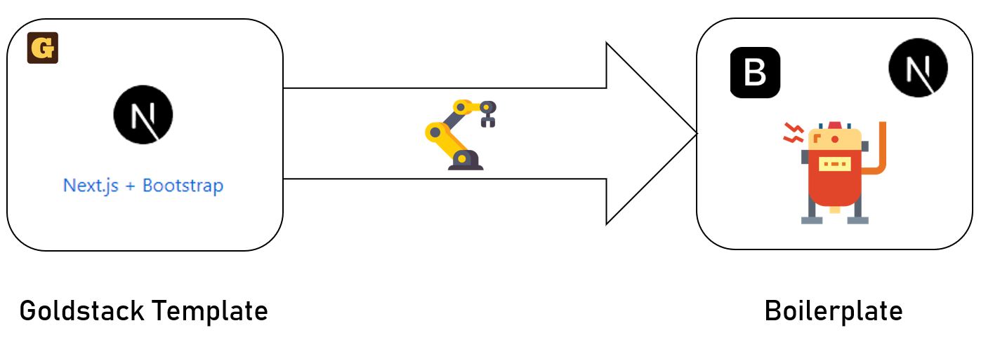

---
categories:
- javascript
- serverless
coverImage: jaime-spaniol-dsqu3n5o3sg-unsplash.jpg
date: "2022-03-10"
blog: maxrohde.com
tags:
- aws
- boilerplate
- bootstrap
- coding
- devops
- goldstack
- next-js
- open-source
- programming
- starter-project
title: Next.js + Bootstrap Boilerplate
---

I has been nearly two years since I first wrote about a [Next.js + Bootstrap starter project](https://maxrohde.com/2020/03/06/next-js-with-bootstrap-getting-started/) on this blog. Since then I have been extending the base template and made it easier to configure and use. It is now available as one of the templates on [Goldstack](https://goldstack.party): [Next.js + Bootstrap Template](https://goldstack.party/templates/nextjs-bootstrap).

While I think using the starter project builder is a great way to launch a new project, it can sometimes be useful to see the source code of a working project; either to clone the whole project to adapt it to your needs, or just to copy and paste the parts you need (commonly known as boilerplate, see for instance [Next.js boilerplate](https://dev.to/joeygoksu/the-ultimate-collection-of-production-ready-nestjs-boilerplate-2d4h), [GraphQL boilerplate](https://dev.to/tuanlc/graphql-clean-architectire-boilerplate-hog) and [React Native boilerplate](https://dev.to/joeygoksu/the-ultimate-react-native-boilerplate-with-typescript-3778)).

Thus, I have created a [**Next.js + Bootstrap boilerplate**](https://github.com/goldstack/nextjs-bootstrap-boilerplate) project on GitHub. This project is automatically generated from the base Goldstack template, so when the template is updated, the boilerplate will automatically be updated as well.

See the project on GitHub here:

[github.com/goldstack/nextjs-bootstrap-boilerplate](https://github.com/goldstack/nextjs-bootstrap-boilerplate).