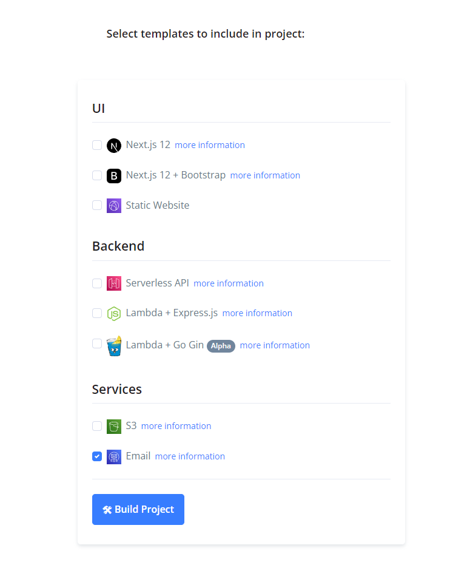

---
categories:
- javascript
- serverless
coverImage: brett-jordan-lpzy4da9aro-unsplash-1.jpg
date: "2022-04-26"
blog: maxrohde.com
tags:
- aws
- aws-ses
- boilerplate
- coding
- devops
- open-source
- programming
- terraform
- tutorial
- typescript
title: SES, Terraform and TypeScript Starter Project
---

[Amazon Simple Email Service (SES)](https://aws.amazon.com/ses/) is a serverless service for sending emails from your applications. Like other AWS services, you can send emails with SES using the [AWS REST API](https://docs.aws.amazon.com/apigateway/latest/developerguide/apigateway-rest-api.html) or the [AWS SDKs](https://aws.amazon.com/tools/). In this article, I want to look at how to send emails using SES with [TypeScript](https://www.typescriptlang.org/) specifically.

## tl;dr

- Fork the automatically updated [SES, Terraform and TypeScript boilerplate](https://github.com/goldstack/ses-terraform-typescript-boilerplate) on GitHub.
- Use the [Goldstack project builder](https://goldstack.party/build) to create a project that includes the [Email Send (SES) template](https://goldstack.party/templates/ses).

## Configure Terraform

Unfortunately, sending an email with SES is not as easy as simply calling an API and having our emails going out into the ether. The very nature of email requires us to configure a few things before we can send our first email, especially when we want to send emails properly:

- We need a domain name that will be used for the `from` address in the emails we sent.
- For this domain, we need to configure [DKIM](https://en.wikipedia.org/wiki/DomainKeys_Identified_Mail) and [SPF](https://en.wikipedia.org/wiki/Sender_Policy_Framework).
- We need to make a request to AWS to enable SES [Moving out of the Amazon SES sandbox](https://docs.aws.amazon.com/ses/latest/dg/request-production-access.html)

All of the above can be easily configured in the AWS console. However, a more robust way to set up our email sending infrastructure is to use Terraform. [Among other benefits](https://poddardiksha.wordpress.com/2021/08/09/introduction-to-infrastructure-as-code-with-terraform-and-how-to-configure-terraform-server/), this can help us to easily set up test environments that are guaranteed to be very similar to our production systems.

In order to configure SES using Terraform, we first need to reference an existing domain on AWS Route 53 (technically we could also create the domain in the same Terraform configuration, but generally we use a domain for many things so I think it is often preferable to configure domains manually and references them in our Infrastructure as Code).

We can reference an existing Route 53 domain using the [`route53_zone`](https://registry.terraform.io/providers/hashicorp/aws/latest/docs/data-sources/route53_zone) data source ([main.tf#L2](https://github.com/goldstack/ses-terraform-typescript-boilerplate/blob/master/packages/email-send-1/infra/aws/main.tf#L2)):

```
data "aws_route53_zone" "main" {
  name         = var.hosted_zone_domain
  private_zone = false
}
```

Next, we must define [`ses_domain_identity`](https://registry.terraform.io/providers/hashicorp/aws/latest/docs/resources/ses_domain_identity) and [`ses_domain_mail_from`](https://registry.terraform.io/providers/hashicorp/aws/latest/docs/resources/ses_domain_mail_from) resources. These are all resource required for the SES service and allow us to start sending emails.

```
resource "aws_ses_domain_identity" "ses_domain" {
  domain = var.domain
}

resource "aws_ses_domain_mail_from" "main" {
  domain           = aws_ses_domain_identity.ses_domain.domain
  mail_from_domain = "mail.${var.domain}"
}
```

However, as mentioned before, we also need to add a few extra records to our domain to support [DKIM](https://en.wikipedia.org/wiki/DomainKeys_Identified_Mail) and [SPF](https://en.wikipedia.org/wiki/Sender_Policy_Framework). We can set these records up as follows:

```
resource "aws_route53_record" "amazonses_verification_record" {
  zone_id = data.aws_route53_zone.main.zone_id
  name    = "_amazonses.${var.domain}"
  type    = "TXT"
  ttl     = "600"
  records = [join("", aws_ses_domain_identity.ses_domain.*.verification_token)]
}

resource "aws_ses_domain_dkim" "ses_domain_dkim" {
  domain = join("", aws_ses_domain_identity.ses_domain.*.domain)
}

resource "aws_route53_record" "amazonses_dkim_record" {
  count   = 3
  zone_id = data.aws_route53_zone.main.zone_id
  name    = "${element(aws_ses_domain_dkim.ses_domain_dkim.dkim_tokens, count.index)}._domainkey.${var.domain}"
  type    = "CNAME"
  ttl     = "600"
  records = ["${element(aws_ses_domain_dkim.ses_domain_dkim.dkim_tokens, count.index)}.dkim.amazonses.com"]
}

resource "aws_route53_record" "spf_mail_from" {
  zone_id = data.aws_route53_zone.main.zone_id
  name    = aws_ses_domain_mail_from.main.mail_from_domain
  type    = "TXT"
  ttl     = "600"
  records = ["v=spf1 include:amazonses.com -all"]
}

resource "aws_route53_record" "spf_domain" {
  zone_id = data.aws_route53_zone.main.zone_id
  name    = var.domain
  type    = "TXT"
  ttl     = "600"
  records = ["v=spf1 include:amazonses.com -all"]
}
```

Please find a complete reference of all Terraform configuration required for an example project here: [infra/aws](https://github.com/goldstack/ses-terraform-typescript-boilerplate/tree/master/packages/email-send-1/infra/aws).

## Send emails using TypeScript

Once your infrastructure is stood up, you can start sending emails from your applications. This can be done using the AWS Rest API or the various SDKs. Here I provide an example of how to send email from TypeScript.

First we initialise the connection to SES:

```
import SES from 'aws-sdk/clients/ses';

const awsUser = new AWS.SharedIniFileCredentials();

const ses = new SES({
  apiVersion: '2010-12-01',
  credentials: awsUser,
  region: '[region]',
});
```

The above assumes that there is a local `.aws/config` and/or `.aws/credentials` file present. Note that the AWS credentials in `awsUser` can be initialised in many different ways, see the file [awsUserUtils.ts](https://github.com/goldstack/goldstack/blob/master/workspaces/templates-lib/packages/infra-aws/src/awsUserUtils.ts) for reference or the AWS documentation on [Setting SDK Credentials in Node.js](https://docs.aws.amazon.com/sdk-for-javascript/v2/developer-guide/setting-credentials-node.html).

And then we can start sending emails with the instance of [`AWS.SES`](https://docs.aws.amazon.com/AWSJavaScriptSDK/latest/AWS/SES.html) that we have created:

```
await ses
  .sendEmail({
    Destination: { ToAddresses: ['test@test.com'] },
    Message: {
      Subject: { Charset: 'UTF-8', Data: 'Test email' },
      Body: {
        Text: {
          Charset: 'UTF-8',
          Data: 'This is the message body in text format.',
        },
      },
    },
    Source: 'sender@mydomain.com',
  })
  .promise();
```

Ensure here that the domain of the email address provided in `Source` matches the domain you have configured in your Terraform.

## Use the Automatically Updated Boilerplate

While the above provides the basic building blocks of setting up a project to send emails using SES, there are many finicky details that need to be configured to get everything working, such as initialising Terraform and configuring a Node project. To make this easier and to give a reference of a working project, I have created a boilerplate project:

[`ses-terraform-typescript-boilerplate`](https://github.com/goldstack/ses-terraform-typescript-boilerplate)

The email send specific logic for this boilerplate is in the folder [packages/emails-send-1](https://github.com/goldstack/ses-terraform-typescript-boilerplate/tree/master/packages/email-send-1).

Note that the [README.md](https://github.com/goldstack/ses-terraform-typescript-boilerplate#readme) of the project contains detailed step-by-step instructions to get this project working for you.

## Use the Goldstack Project Builder

An application that does nothing else but send emails is not a very useful one in most cases. Thus we would often want to combine a capability to send emails with other features, such as providing an API and frontend. This is something that we can easily do with the [Goldstack project builder](https://goldstack.party/build).



Simply select the templates you want to include in the project and then use the web-based wizard in Goldstack to configure your project (such as the domain to send emails from). Goldstack will then assemble your project in a ZIP file you can download and start your development journey from.

## Help Make the Template and Boilerplate Better

Please raise an issue on [GitHub](https://github.com/goldstack/goldstack/issues) if you have an idea of how to improve this template. Note the [boilerplate](https://github.com/goldstack/ses-terraform-typescript-boilerplate) is automatically generated from the [template](https://github.com/goldstack/goldstack/tree/master/workspaces/templates/packages/email-send) defined in the Goldstack repository.