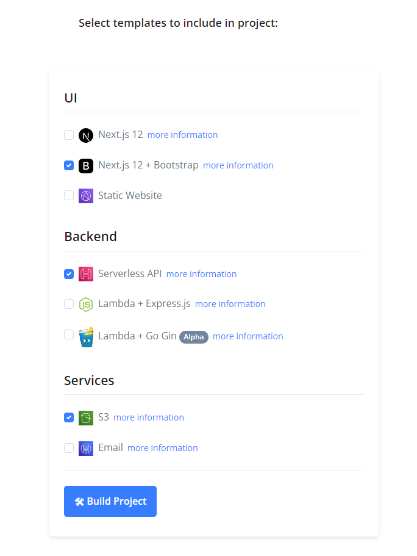

---
authors:
- max
blog: maxrohde.com
categories:
- javascript
- serverless
coverImage: jessica-johnston-nnh2l-k77nc-unsplash.jpg
date: "2022-04-27"
tags:
- aws
- aws-s3
- coding
- programming
- typescript
title: S3 and Typescript
---

[AWS S3](https://aws.amazon.com/s3/) is a cloud service for storing data using a simple API. In contrast to a traditional database, S3 is more akin to a file system. Data is stored under a certain path. The strengths of S3 are its easy to use API as well as its very low cost for storing data.

While S3 has traditionally been used for storing larger files, it can also be used as a lightweight key-value store. Using [Amazon Athena](https://aws.amazon.com/athena/) we can even run rather complex queries over our data if we store it in a structured data format such as JSON.

This article describes how we can use AWS S3 in a TypeScript application. This article uses the [S3 Terraform TypeScript boilerplate](https://github.com/goldstack/s3-terraform-typescript-boilerplate) as reference. You can clone the project on GitHub or create a project using the [S3 Template](https://goldstack.party/templates/s3).

## Infrastructure Setup

Before we can interact with S3 from our TypeScript application, we need to create the S3 bucket on AWS. This can be achieved by using the [AWS console](https://docs.aws.amazon.com/AmazonS3/latest/userguide/create-bucket-overview.html). We could also use the SDK in TypeScript to [create a bucket](https://docs.aws.amazon.com/AWSJavaScriptSDK/latest/AWS/S3.html#createBucket-property). However, creating infrastructure such as a bucket programmatically has a number of drawbacks (such as we need to keep track of what resources we have already created). Thus it is better to use Infrastructure as Code such as using [Terraform](https://pradeepedwin.wordpress.com/devops/terraform/).

While there are alternatives to Terraform such as [Pulumi](https://www.pulumi.com/), Terraform is very widely used and thus we will use it in this article. Thankfully, it is very easy to set up an S3 bucket in Terraform. We need can define it with [`aws_s3_bucket`](https://registry.terraform.io/providers/hashicorp/aws/latest/docs/resources/s3_bucket) resource in a file as follows (see [main.tf](https://github.com/goldstack/s3-terraform-typescript-boilerplate/blob/master/packages/s3-1/infra/aws/main.tf)):

```hcl
resource "aws_s3_bucket" "main" {
  bucket = "${var.bucket_name}"

  # Remove this line if you want to prevent accidental deletion of bucket
  force_destroy = true

  tags = {
    ManagedBy = "terraform"
    Changed   = formatdate("YYYY-MM-DD hh:mm ZZZ", timestamp())
  }

  lifecycle {
    ignore_changes = [tags]
  }
}
```

In additional we need to configure Terraform to use the AWS provider (see [providers.tf](https://github.com/goldstack/s3-terraform-typescript-boilerplate/blob/master/packages/s3-1/infra/aws/providers.tf)):

```hcl
terraform {
  required_providers {
    aws = {
      source  = "hashicorp/aws"
      version = "3.72.0"
    }
  }
  required_version = ">= 0.13"
}

provider "aws" {
  region                  = var.aws_region

   # Skipping various checks to speed up AWS provider
  skip_region_validation      = true
  skip_get_ec2_platforms      = true
  skip_metadata_api_check     = true
  skip_credentials_validation = true
}

terraform {
  backend "s3" {
    # config provided dynamically using `--backend-config` CLI parameters

    # Skipping various checks to speed up backend initialisation
    skip_credentials_validation = true
    skip_metadata_api_check     = true
    skip_region_validation      = true
  }
}
```

Note this contains a number of additional configuration options that can help running Terraform faster.

## Working with Buckets in TypeScript

In order to work with the bucket we have created in TypeScript, we first need to authenticate our application with AWS. For this, we first need to [create a user on AWS](https://docs.goldstack.party/docs/goldstack/configuration#how-to-get-aws-credentials). Once we have done that, we can supply our credentials to the AWS SDK in [various ways](https://docs.aws.amazon.com/sdk-for-javascript/v2/developer-guide/setting-credentials-node.html).

In this sample project, we use the [@goldstack/template-s3](https://www.npmjs.com/package/@goldstack/template-s3) library to make it easier for us to integrate with AWS. Please see the [Goldstack documentation](https://docs.goldstack.party/docs/goldstack/configuration) for more information of how the configuration works. If you simply want to [clone the boilerplate](https://github.com/goldstack/s3-terraform-typescript-boilerplate) you can follow the [Getting Started documentation](https://github.com/goldstack/s3-terraform-typescript-boilerplate#getting-started) there.

Once we have our credentials, we simply instantiate the [`AWS.S3`](https://docs.aws.amazon.com/AWSJavaScriptSDK/latest/AWS/S3.html) class (see [templateS3Bucket.ts](https://github.com/goldstack/goldstack/blob/master/workspaces/templates-lib/packages/template-s3/src/templateS3Bucket.ts#L38)):

```typescript
const s3 = new S3({
  apiVersion: '2006-03-01',
  credentials: credentials,
  region: region,
});
```

We can then use the resulting object to [work with our bucket](https://dev.to/metacollective/s3-helper-functions-in-typescript-di5). The most common operations will be [`putObject`](https://docs.aws.amazon.com/AWSJavaScriptSDK/latest/AWS/S3.html#putObject-property) to add data to our bucket and [`getObject`](https://docs.aws.amazon.com/AWSJavaScriptSDK/latest/AWS/S3.html#getObject-property) to read from our bucket.

```typescript
await s3.putObject({
  BucketName: 'my-bucket',
  Key: 'my-doc',
  Body: 'content',
});
```

## Using the S3 TypeScript Boilerplate

If you want to use the boilerplate project, there are [detailed instructions](https://github.com/goldstack/s3-terraform-typescript-boilerplate#getting-started) of how to set it up on GitHub.


## Using the Goldstack Project Builder

Usually when working with an S3 bucket in an application, we would want the application to do additional things as well, such as provide a backend server or a frontend. The [Goldstack Project Builder](https://goldstack.party/build) enables us to combine the S3 templates with other templates such as a [Serverless API template](https://goldstack.party/templates/serverless-api) and configure our project using a web-based interface.



## Help Make the Template and Boilerplate Better

Please raise an issue on [GitHub](https://github.com/goldstack/goldstack/issues) if you have an idea of how to improve the S3 template and boilerplate.