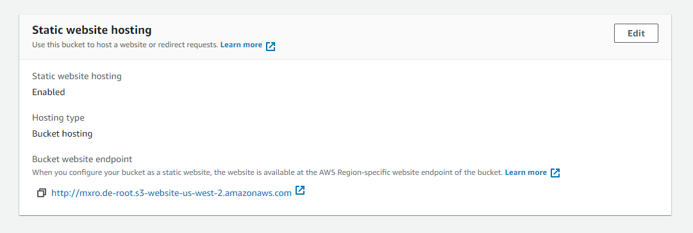

---
authors:
- max
blog: maxrohde.com
categories:
- devops
- serverless
coverImage: florian-olivo-4hbj-eymz1o-unsplash.jpg
date: "2022-05-07"
tags:
- amazon-route-53
- aws
- aws-s3
- cloudfront
- javascript
- programming
- ssl
- terraform
title: The Ultimate Guide to Hosting Static Websites using S3
---

[AWS S3](https://aws.amazon.com/s3/) has long been known as an effective way to [host static websites](https://dinfratechsource.wordpress.com/2019/07/28/host-a-static-site-on-aws-using-s3-and-cloudfront/) and assets. Unfortunately, while it is easy to [configure an S3 bucket to enable static file hosting](https://howtoember.wordpress.com/2020/06/11/aws-static-website-hosting-with-cognito-and-s3/), it is quite complicated to achieve the following:

- Use your own domain name
- Enable users to access the content using a secure `https://` link
- Upload changes in an automated and safe way
- Develop and test locally
- Define all infrastructure as code

In the following, I will discuss various aspects of hosting static website with S3 that we need to be aware of to enable all of the above. This article has a companion project on GitHub: [static-website-boilerplate](https://github.com/goldstack/static-website-boilerplate). Examples will refer to this project. The project is implemented using TypeScript and Terraform.

## tl;dr

If you are interested in getting your own website up and running as quickly as possible consider using the following open source [Goldstack](https://goldstack.party) template:

[Static Website Template](https://goldstack.party/templates/static-website)

## Static Website Hosting on S3

Static website hosting has long been a feature of S3 buckets that can be enabled in the bucket properties.



AWS has a good documentation for the step-by-step instructions to enable static website hosting: [Enable Website Hosting / Using the S3 Console](https://docs.aws.amazon.com/AmazonS3/latest/userguide/EnableWebsiteHosting.html).

When using Terraform, this is also relatively easy to configure using the [`aws_s3_bucket`](https://registry.terraform.io/providers/hashicorp/aws/latest/docs/resources/s3_bucket) resource (see [root.tf](https://github.com/goldstack/static-website-boilerplate/blob/master/packages/static-website-1/infra/aws/root.tf)):

```hcl
resource "aws_s3_bucket" "website_root" {
  bucket = "[your bucket name]"

  acl = "public-read"

  website {
    index_document = "index.html"
    error_document = "404.html"
  }

  policy = <<EOF
{
  "Version": "2008-10-17",
  "Statement": [
    {
      "Sid": "PublicReadForGetBucketObjects",
      "Effect": "Allow",
      "Principal": {
        "AWS": "*"
      },
      "Action": "s3:GetObject",
      "Resource": "arn:aws:s3:::[your bucket name]/*"
    }
  ]
}
EOF

}
```

Replace `[your bucket name]` with the bucket name you want to use. Note that a bucket name needs to be globally unique across all AWS accounts.

Note we are defining a [`website`](https://registry.terraform.io/providers/hashicorp/aws/latest/docs/resources/s3_bucket#static-website-hosting) property here that defines the index and error document. Providing this will enable static website hosting. We also provide the access control list (`acl`) `public-read`. In addition, we also provide a policy for public read.

## Support TLS using Amazon Certificate Manager

Configuring a bucket for static website access will provide us with a publicly accessible URL such as `http://mxro.de-root.s3-website-us-west-2.amazonaws.com/`. This is usually not what we are after. First we would like to use our own domain name. Secondly we would like our users to access our website using TLS using a `https://` URL.

To achieve this, will require a few steps, but we can start with [acquiring a TLS certificate](https://k21academy.com/amazon-web-services/aws-certificate-manager-acm/). AWS provides these for free using the [AWS Certificate Manager](https://aws.amazon.com/certificate-manager/).

Again AWS provides good documentation about how to obtain certificate using the AWS console: [Requesting a public certificate](https://docs.aws.amazon.com/acm/latest/userguide/gs-acm-request-public.html).

For Terraform, we can provision a certificate using the resource [`aws_acm_certificate`](https://registry.terraform.io/providers/hashicorp/aws/latest/docs/resources/acm_certificate) ([main.tf#13](https://github.com/goldstack/static-website-boilerplate/blob/master/packages/static-website-1/infra/aws/main.tf#L13)).

```hcl
resource "aws_acm_certificate" "wildcard_website" {
  provider = aws.us-east-1

  domain_name               = "[your domain]"
  subject_alternative_names = ["*.your domain"]
  validation_method         = "DNS"

  lifecycle {
    create_before_destroy = true
  }
}
```

Again replace `[your domain]` with the domain you want to use for your website.

Note we specify a special provider with `provider = aws.us-east-1`. Ensure you declare this provider (e.g. see [proviers.tf#26](https://github.com/goldstack/static-website-boilerplate/blob/master/packages/static-website-1/infra/aws/providers.tf#L26)). We need to declare this provider since the [wildcard certificate used by CloudFront requires this specific region](https://docs.aws.amazon.com/AmazonCloudFront/latest/DeveloperGuide/cnames-and-https-requirements.html) and we will use CloudFront in the next step.

We set the `create_before_destroy` lifecycle to avoid downtimes for our websites.

## Use CloudFront as CDN

In the previous step we have generated a TLS certificate for our website. However, there is no way to link this directly to the static website served by S3. Instead we need to use the [CloudFront](https://aws.amazon.com/cloudfront/) CDN, which will allow us to use a custom domain name, link this with our certificate and then serve the files we have stored on S3.

Again, there is decent documentation available on AWS of how to set up CloudFront: [How do I use CloudFront to serve a static website hosted on Amazon S3?](https://aws.amazon.com/premiumsupport/knowledge-center/cloudfront-serve-static-website/). However, note that CloudFront is a much for complex service than the other services we have used so far. So, if you want to set this up on your own, I would recommend doing some reading of the [CloudFront documentation](https://docs.aws.amazon.com/AmazonCloudFront/latest/DeveloperGuide/Introduction.html), especially around [distributions](https://docs.aws.amazon.com/AmazonCloudFront/latest/DeveloperGuide/distribution-overview.html).

There are multiple ways in which we can connect an S3 bucket with a CloudFront distribution. In our example project, we use a simple HTTP-origin.

In Terraform, we can use the [`aws_cloudfront_distribution`](https://registry.terraform.io/providers/hashicorp/aws/latest/docs/resources/cloudfront_distribution) resource to configure CloudFront. However, since CloudFront is quite a complex service, there are quite a few things to configure ([root.tf#45](https://github.com/goldstack/static-website-boilerplate/blob/master/packages/static-website-1/infra/aws/root.tf#L45)):

```hcl
resource "aws_cloudfront_distribution" "website_cdn_root" {
  enabled     = true
  price_class = "PriceClass_All"
  aliases     = ["[your domain name]"]
  provider    = aws.us-east-1

  origin {
    domain_name = aws_s3_bucket.website_root.website_endpoint

    origin_id   = "origin-bucket-${aws_s3_bucket.website_root.id}"

    custom_origin_config {
      http_port = 80
      https_port = 443
      origin_protocol_policy = "http-only"
      origin_ssl_protocols = ["TLSv1.2"]
    }
  }

  default_root_object = "index.html"

  default_cache_behavior {
    allowed_methods  = ["GET", "HEAD", "OPTIONS"]
    cached_methods   = ["GET", "HEAD"]
    target_origin_id = "origin-bucket-${aws_s3_bucket.website_root.id}"
    min_ttl          = "0"
    default_ttl      = "20"
    max_ttl          = "1200"

    viewer_protocol_policy = "redirect-to-https" # Redirects any HTTP request to HTTPS
    compress               = true

    forwarded_values {
      query_string = false
      cookies {
        forward = "none"
      }
    }

  }

  restrictions {
    geo_restriction {
      restriction_type = "none"
    }
  }

  viewer_certificate {
    acm_certificate_arn = data.aws_acm_certificate.wildcard_website.arn
    ssl_support_method  = "sni-only"
  }

  custom_error_response {
    error_caching_min_ttl = 60
    error_code            = 404
    response_page_path    = "/404.html"
    response_code         = 404
  }

  lifecycle {
    ignore_changes = [
      viewer_certificate,
    ]
  }
}
```

Key in this configuration is the `origin` which we connect with the S3 bucket we have created. Note we are using `http-only`. HTTP will have less latency than HTTPs and cause less costs.

The `alias` property needs to be set to the domain name we want to use.

## Configure Route 53 to use Your Own Domain

The last AWS service we need to configure to get our static website up and running is [Route 53](https://aws.amazon.com/route53/). Route 53 can be used to define the DNS records for our website. You can use Route 53 to register your domain name or configure a domain you have obtained from a different registrar.

The AWS documentation for setting up Route 53 for your domain is quite involved: [Configuring Amazon Route 53 as your DNS service](https://docs.aws.amazon.com/Route53/latest/DeveloperGuide/dns-configuring.html). I have created a bit more concise reference in the Goldstack documentation: [Hosted Zone Configuration](https://docs.goldstack.party/docs/goldstack/configuration#hosted-zone-configuration).

After we have configured our domain in Route 53, we can now start adding the DNS records we need for our website. We need records for the following:

- We need to connect our domain to the CloudFront distribution we have configured in the previous step
- We need to create records to validate the TLS certificate we have created (since we used DNS validation)

We can use the [`aws_route53_record`](https://registry.terraform.io/providers/hashicorp/aws/latest/docs/resources/route53_record) resource to configure the records we need.

To link our CloudFront distribution we can set up a simple `alias` `A` record ([root.tf#121](https://github.com/goldstack/static-website-boilerplate/blob/master/packages/static-website-1/infra/aws/root.tf#L121)):

```hcl
resource "aws_route53_record" "website_cdn_root_record" {
  zone_id = data.aws_route53_zone.main.zone_id
  name    = var.website_domain
  type    = "A"

  alias {
    name                   = aws_cloudfront_distribution.website_cdn_root.domain_name
    zone_id                = aws_cloudfront_distribution.website_cdn_root.hosted_zone_id
    evaluate_target_health = false
  }
}
```

For validating our certificate we need to create a couple of records as follows ([main.tf#31](https://github.com/goldstack/static-website-boilerplate/blob/master/packages/static-website-1/infra/aws/main.tf#L31)):

```hcl
resource "aws_route53_record" "wildcard_validation" {
  provider = aws.us-east-1
  for_each = {
    for dvo in aws_acm_certificate.wildcard_website.domain_validation_options : dvo.domain_name => {
      name   = dvo.resource_record_name
      record = dvo.resource_record_value
      type   = dvo.resource_record_type
    }
  }

  allow_overwrite = true
  name            = each.value.name
  type            = each.value.type
  zone_id         = data.aws_route53_zone.main.zone_id
  records         = [each.value.record]
  ttl             = 60
}

```

Please see all files in the [`infra/aws`](https://github.com/goldstack/static-website-boilerplate/tree/master/packages/static-website-1/infra/aws) folder for a complete reference of all Terraform configuration required.

My advise would be rather than to set this up step by step by yourself to use the [static-website](https://goldstack.party/templates/static-website) template to get a basic setup working. From there, you can then modify the Terraform configuration as required.

## Safely Upload Changes

Once we have setup all infrastructure required for our static website, we need a way to upload files to the S3 bucket. There are [many ways](https://neelbhatt.com/2017/05/26/best-tools-for-s3-amazon-web-serviceaws/) to upload files to an S3 bucket. We specifically would like one that works well within our development workflow.

The AWS cli provides a [`sync`](https://awscli.amazonaws.com/v2/documentation/api/latest/reference/s3/sync.html) operation that is very useful to upload local files. We just need to be aware of one gotcha - if we replace/delete files we ideally do not want to have any downtime for your website! And `sync` may delete files first before uploading new files.

Therefore we would want to run the `sync` operation twice. First to upload any new changes, and after that a second time with the `--delete` flag to delete any superfluous files. For this, I have developed a small library [`utils-s3-deployment`](https://www.npmjs.com/package/@goldstack/utils-s3-deployment) that will run these two commands in one go. Key method in this library is the `upload` function in [`utilsS3Deployment.ts`](https://github.com/goldstack/goldstack/blob/master/workspaces/templates-lib/packages/utils-s3-deployment/src/utilsS3Deployment.ts#L13).

If you use the [boilerplate](https://github.com/goldstack/static-website-boilerplate) or [template](https://goldstack.party/templates/static-website) you can simply trigger a deployment of all new files by running `yarn deploy prod` in the `packages/static-website-aws-1` folder.

## Support Local Development

While uploading to S3 is usually quite fast, it is generally very useful to test changes locally. For this, we simply need to run a local web server. One of the easiest ways to do this is to use [Python](https://pythonbasics.org/webserver/) if that is available on your system, but there are [countless](https://davehaxblog.wordpress.com/2017/06/10/2-minute-http-or-local-web-server-using-node-js/amp/) [other](https://buddhimawijeweera.wordpress.com/2014/12/25/creating-http-server-with-java/) [options](https://chrisbitting.com/2014/06/16/local-web-server-for-testing-development-using-node-js-and-http-server/) to run a local web server.

The for the template (and in turn the boilerplate project), I decided to use the [`light-server`](https://www.npmjs.com/package/light-server) library which among other features offers hot reload. In the template, you can simply run `yarn watch` to start the local development server.

## Host a Next.js Application

[Next.js](https://nextjs.org/) offers an option to generate a [static HTML export](https://nextjs.org/docs/advanced-features/static-html-export) for Next.js applications. Such an export can be uploaded as is to an S3 bucket configured as suggested here to serve a Next.js application through AWS. This is the approach I have used for the [Next.js + Bootstrap](https://goldstack.party/templates/nextjs-bootstrap) and [Next.js](https://goldstack.party/templates/nextjs) templates.

Other frameworks that generate static files such as [Gatsby](https://www.gatsbyjs.com/) also generate pages that can easily be uploaded to S3.

## Final Thoughts

Hosting a simple static website is one of those things one would expect to be easier on AWS (it is by far from the only one). AWS seem to have recognised this and now offer the [AWS Amplify Hosting](https://aws.amazon.com/amplify/hosting/) service. I have not used this service myself but like other services branded under the Amplify umbrella it will come with the usual trade-off: a quicker setup for less flexibility.

While I hope this article provides some guidance for setting up S3 static web hosting, I am certain for someone who is not an expert in AWS it will still take many hours to set up things successfully. Thus I created the [static website](https://goldstack.party/templates/static-website) template to help anyone set up a working website in a fraction of the time usually required; while not sacrificing any flexibility, since all infrastructure is defined in Terraform and can easily be changed and extended.

Consider helping out making this template better for others by [raising an issue in GitHub](https://github.com/goldstack/goldstack/issues) if you encounter any problems or have questions or ideas.