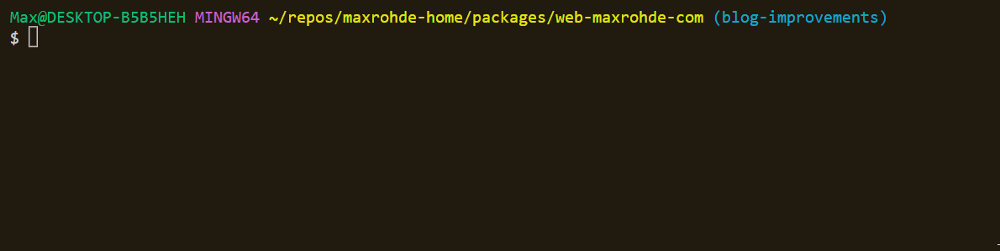

---
authors:
- max
blog: maxrohde.com
categories:
- javascript
- code
coverImage: serverless-react-ssr-cover.jpg
date: "2022-10-16"
id: serverless-react-ssr
summary: Explores how to implement React Server-Side Rendering (SSR) in a serverless
  way on AWS using a lightweight framework.
tags:
- react
- ssr
- serverless
- aws
- lambda
title: Serverless React SSR
---

Server-side rendering (SSR) of React applications has become increasingly popular in the past few years. Frameworks such as [Remix](https://remix.run/) and [Next.js](https://nextjs.org/) have demonstrated that rendering pages on the server with React is an effective way to compose applications.

In this post, I will explore how to develop a **truly serverless** implementation for React SSR that provides:

- 📦 One optimised Lambda package per page
- 🚀 Efficient distribution of client-side scripts
- 🐦 Lightweight framework that is easy to customise

## tldr;

To get started on implementing a Serverless React SSR application, be welcome to use the customisable template I have prepared:

- 🌟 [Goldstack Server-Side Rendering Template](https://goldstack.party/templates/server-side-rendering)

This template can also be forked on GitHub:

- 🍴 [react-ssr](https://github.com/goldstack/react-ssr)

## A Bit of History and Motivation

Feel free to skip this section and scroll down straight to the code 🤗.

This post is a cumulation of many years of strive and experimentation. I have long been searching for a way to develop web applications in a way that results in beautiful code ('easy to read') and just as beautiful infrastructure ('low cost, easy to maintain').

I found [Next.js](https://nextjs.org/) to be pretty close to my ideal. However, it is lacking in two key aspects: 1) Next.js introduces a lot of magic that makes it difficult to deeply customise an application. 2) It is difficult to [deploy Next.js to AWS](https://maxrohde.com/2021/01/30/deploy-next-js-to-aws).

After [Wordpress](https://wordpress.com/) has been annoying me for years, I decided after long hesitation to migrate my blog [Code of Joy](https://maxrohde.com) away from Wordpress. After searching through many available options (including different blog hosting platforms and static rendering solutions such as [Gatsby](https://www.gatsbyjs.com/)), I decided that the best option for me would be to implement my own custom blog. 

I did not make this decision lightly. I always told myself that tinkering around with the blog itself was just a way for me to procrastinate on writing articles. However, I figured that this could be a good coding practice for myself and help me improve my open-source project, the [Goldstack Project Builder](https://goldstack.party).

The most suitable template I had available to me in Goldstack at the time I started my blog project was the [Next.js template](https://goldstack.party/templates/nextjs). However, for the aforementioned reasons, I decided that a blog would be served better by a new template. Specifically, a template that would support server-side rendering on AWS in a better way than Next.js does (Next.js supports server-side rendering outside of Vercel deployments, but it needs to be deployed on a VM, as a Docker image or as all code bundled up in one Lambda; all options that are not very 'serverless').

Thus, I started the process of developing a server-side rendering friendly template [a few months ago](https://github.com/goldstack/goldstack/commit/ac13d13a915d225486ba42815aac3e7f2c153fbf). I released this template a while ago and have since also completed the implementation of the new version of my blog. This post contains my experiences and learnings from this process.

## Defining Routes

I love the way routes are defined in [Next.js](https://nextjs.org/docs/routing/introduction): one simply creates files in a dedicated directory and Next.js automatically configures routes matching the file name and paths.

Many serverless frameworks require to configure complex YAML of JSON files for defining routes. However, I wanted to maintain the same level of convenience as Next.js offers for my serverless SSR implementation.

I thus I defined the following rules for generating routes:

-   **Basic Routing**: The names of files is used for the names of resources. For instance, `src/routes/page.tsx` will available under `mypage.com/page`.
-   **Subfolders**: Names of folders will be used in the path to resources. For instance, `src/routes/group/page.tsx` will be available under `mypage.com/group/page`.
-   **Index Pages**: For defining a route that matches `/` within a folder (or the root of the website), a source file with the name `$index.tsx` can be defined. For instance, `src/routes/group/$index.tsx` will be available under `api.com/group/`.
-   **Default Fallback**: To define a fallback that is called when no route is matched, define a source file with the name `$default.tsx`. There should only be one `$default.tsx` file in the API. This will match all paths that are not covered by other routes.
-   **Path Parameters**: Parameters in path are supported using the syntax `{name}`. For instance, `src/user/{name}.tsx` will make the parameter `name` available in the endpoint. Parameters are also supported as folder names.
-   **Greedy Paths**: If a parameter should match multiple resource levels, it can be defined as follows `{greedy+}`. For instance `src/group/{greedy+}.tsx` will match `mypage.com/group/1` and `mypage.com/group/some/path` and all other paths under `group/`.

See below all the routes I have [defined for my blog](https://github.com/mxro/maxrohde-web/tree/blog-improvements/packages/web-maxrohde-com/src/routes):


Please see the section _Defining Infrastructure_ below for an explanation how these routes are projected onto serverless infrastructure.

## Defining Handlers

The next step after defining the routes our server should resolve is to define the actual handlers that provide the responses.

See below a sample handler ([`posts.tsx`](https://github.com/goldstack/react-ssr/blob/9fcbe5204697546ec2b5268b637b0012a582eb17/packages/server-side-rendering-1/src/routes/posts.tsx)):

```typescript
import React from 'react';
import { SSRHandler } from '@goldstack/template-ssr';

import { renderPage, hydrate } from './../render';

const Posts = (props: { posts: string[] }): JSX.Element => {
  return (
    <>
      <p>Posts:</p>
      {props.posts.map((p, idx) => (
        <div key={idx}>{p}</div>
      ))}
    </>
  );
};

// eslint-disable-next-line @typescript-eslint/no-unused-vars
export const handler: SSRHandler = async (event, context) => {
  return renderPage({
    component: Posts,
    appendToHead: '<title>Posts</title>',
    properties: {
      posts: ['post1', 'post2', 'post3', 'posts4'],
    },

    entryPoint: __filename,
    event: event,
  });
};

hydrate(Posts);

export default Posts;
```

(This is just the handler in the automatically generated sample project, if you are interested in the actual handler from my blog, please see [`$index.tsx`](https://github.com/mxro/maxrohde-web/blob/618c563ae20a99c91ee0fa48102d784a34a594b2/packages/web-maxrohde-com/src/routes/%24index.tsx) which renders a list of posts.)

Key here is the `handler` method that performs the server-side rendering using the helper method `renderPage` as well as the `hydrate(Posts);` statement that ensures the page is initialised correctly on the client-side.

Note that these handlers support both server-side rendering as well as defining client-side interactivity.

Should you require any specific server-side only npm dependencies, it is advisable to create a second source file and define a method there that is called in the `handler` method.

(This was required for the `$index.tsx` file referenced above which requires making some queries to DynamoDB, see [`renderIndex.ts`](https://github.com/mxro/maxrohde-web/blob/618c563ae20a99c91ee0fa48102d784a34a594b2/packages/web-maxrohde-com/src/ssr/renderIndex.ts).)

We can then use the [`esbuild-ignore-with-comments-plugin`](https://www.npmjs.com/package/esbuild-ignore-with-comments-plugin) to ensure none of the dependencies are included during client-side bundling by placing the comment `/* esbuild-ignore ui */`  at the beginning of our source file.

For instance, you can define a script as the following (`src/server/render.rs`):

```typescript
/* esbuild-ignore ui */

import { renderPage } from './../render';
import fs from 'fs';

export async function performRender({
  event,
}: {
  event: APIGatewayProxyEventV2;
}): Promise<APIGatewayProxyResultV2> {
  // do Node.js things ...
}
```

And then import this render function in your handler:

```typescript
import * as render from './../server/render'; 

export const handler: SSRHandler = async (event, context) => {
	return render.performRender(event);
}
```

## Defining Infrastructure

Serverless projects often require more complex infrastructure definitions than micro-service based or monolithic implementations. For instance, in a monolithic application we define one primary compute instance and in a serverless project we would generally have our compute distributed among many different components of our infrastructure.

As outlined in the beginning of this post, one of the key features I was interested in was to deploy each page or route in an individual Lambda function to ensure fast cold-start times.

I decided to define an architecture as follows: A [CloudFront Distribution](https://docs.aws.amazon.com/AmazonCloudFront/latest/DeveloperGuide/Introduction.html) functions as the initial ingress to the application. Static files are served through [AWS S3](https://aws.amazon.com/s3/). For each defined route we define a [Lambda](https://aws.amazon.com/lambda/) function and an [AWS HTTP API Gateway](https://docs.aws.amazon.com/apigateway/latest/developerguide/http-api.html) is used to route traffic to the correct lambda:


Extensibility for me is key in defining infrastructure, especially in a serverless project, since we usually need to extend or modify our infrastructure in order to implement further features.

Thus I opted for using [Terraform](https://www.terraform.io/) to define the infrastructure. See all required Terraform configuration in [`infra/aws`](https://github.com/goldstack/react-ssr/tree/master/packages/server-side-rendering-1/infra/aws).

I decided to provide one common [configuration for all Lambdas](https://github.com/goldstack/react-ssr/blob/9fcbe5204697546ec2b5268b637b0012a582eb17/packages/server-side-rendering-1/infra/aws/lambda_routes.tf#L13) optimised for [cold starts](https://medium.com/geekculture/pick-the-right-memory-size-for-your-aws-lambda-functions-682394aa4b21). 

```hcl
resource "aws_lambda_function" "this" {
  for_each  = var.lambdas
  
  function_name =  lookup(each.value, "function_name", null)

  filename = data.archive_file.empty_lambda.output_path

  handler = "lambda.handler"
  runtime = "nodejs18.x"

  memory_size = 2048
  timeout = 27 # default Gateway timeout is 29 s

  role = aws_iam_role.lambda_exec.arn

  lifecycle {
    ignore_changes = [
       filename,
    ]
  }

  environment {
    variables = {
      GOLDSTACK_DEPLOYMENT = var.name
      CORS                 = var.cors
      NODE_OPTIONS         = "--enable-source-maps"
    }
  }
}
```

Note that the variable `lambdas` is dynamically provided by some tooling that translates the files in the `src/routes` folder into function configurations in the file [`goldstack.json`](https://github.com/goldstack/react-ssr/blob/9fcbe5204697546ec2b5268b637b0012a582eb17/packages/server-side-rendering-1/goldstack.json#L17). 

```json
{
    "lambdas": {
          "ANY /": {
            "function_name": "goldstack-ci-test-server-side-rendering-1665262198346--__index",
            "route": "ANY /"
          },
          "ANY /posts": {
            "function_name": "goldstack-ci-test-server-side-rendering-1665262198346-posts",
            "route": "ANY /posts"
          }
    }
}
```

This configuration is dynamically updated by a [small utility](https://github.com/goldstack/goldstack/blob/master/workspaces/templates-lib/packages/utils-aws-lambda/src/generate/collectLambdasFromFiles.ts) packaged in the npm package [`@golstack/utils-aws-lambda`](https://www.npmjs.com/package/@goldstack/utils-aws-lambda) as new routes are defined.

## Deployment

Apart from defining the infrastructure for our lambda functions and static files, we also need to deploy the code and resources we have developed to the AWS infrastructure.

I decided to use the [AWS CLI](https://aws.amazon.com/cli/) to deploy both function code as well as static resources. To avoid having to install the CLI on the local machine, [Docker](https://www.docker.com/) is used to run the CLI.

There are a few steps involved in bundling and deploying the Lambdas as well as generating and deploying the static resources. These are orchestrated using a few scripts written in TypeScript. These are defined in the library [`template-ssr-cli`](https://github.com/goldstack/goldstack/tree/master/workspaces/templates-lib/packages/template-ssr-cli).

The trickiest part of the deployment process is the client and server-side bundling, which are each discussed in further detail below:

### Server-Side Bundling

In order to deploy a Serverless SSR application, we need to bundle the code to ensure we only deploy the necessary code to each function.

This can be achieved with most JavaScript bundlers such as [Webpack](https://webpack.js.org/), [Rollup](https://rollupjs.org/guide/en/) or [esbuild](https://esbuild.github.io/).

I have decided to use _esbuild_ for my reference implementation since it is fast and easy to customise. The configuration for esbuild is defined in the file [`src/build.ts`](https://github.com/goldstack/react-ssr/blob/9fcbe5204697546ec2b5268b637b0012a582eb17/packages/server-side-rendering-1/src/build.ts):

```typescript
	return {
        plugins: [
          ignorePlugin({ ignore: ['server'] }),
          cssPlugin({
            excludeCSSInject: true,
            onCSSGenerated: args.onCSSGenerated,
          }),
          pnpPlugin(),
        ],
        bundle: true,
        external: [
          'aws-sdk', // included in Lambda runtime environment
        ],
        minify: true,
        platform: 'node',
        format: 'cjs',
        target: 'node16.0',
        treeShaking: true,
        define: {
          'process.env.NODE_ENV': '"production"',
        }, // see https://github.com/evanw/esbuild/issues/2377
        sourcemap: true,
        metafile: false,
    };
```

This configuration uses both the [`esbuild-css-modules-client-plugin`](https://www.npmjs.com/package/esbuild-css-modules-client-plugin) and the [`esbuild-ignore-with-comments-plugin`](https://www.npmjs.com/package/esbuild-ignore-with-comments-plugin). The former is used to support [CSS modules](https://github.com/css-modules/css-modules) and the latter is used to ensure no files are included in the bundle that are only required on the client.

Note that the target of the bundle is `node16` and the format is `commonjs` as per [AWS recommendations](https://docs.aws.amazon.com/lambda/latest/dg/lambda-typescript.html).

Apart from this, the generated `.js` and `.css` files are simply zipped and are ready to upload to AWS using the AWS CLI. See below the Zip files generated for my blog based on the routes shown earlier:


### Client-Side Bundling

Client-side bundling is also performed using esbuild and the configuration is also supplied in [`src/build.ts`](https://github.com/goldstack/react-ssr/blob/9fcbe5204697546ec2b5268b637b0012a582eb17/packages/server-side-rendering-1/src/build.ts) :

```typescript
	return {
        plugins: [
          ignorePlugin({ ignore: ['ui'] }),
          cssPlugin({
            excludeCSSInject: !args.includeCss,
            cssConfig: {
              plugins: [],
            },
          }),
          pnpPlugin(),
        ],
        bundle: true,
        outfile: '/dist/tmp/bundle.js', // this is used for nothing. But if not supplying it, CSS modules plugin fails
        external: [
          'esbuild',
          '@yarnpkg/esbuild-plugin-pnp',
          '@swc/core',
          '@swc/jest',
          '@goldstack/template-ssr-server', // this is only required on the server side
        ],
        minify: true,
        sourcemap: 'inline',
        metafile: false,
        platform: 'browser',
        format: 'iife',
        treeShaking: true,
    };
```

This configuration also uses the [`esbuild-css-modules-client-plugin`](https://www.npmjs.com/package/esbuild-css-modules-client-plugin) and the [`esbuild-ignore-with-comments-plugin`](https://www.npmjs.com/package/esbuild-ignore-with-comments-plugin).

The generated bundle and CSS files are not included in the Zip files that are being uploaded to the Lambdas. Instead, they are uploaded to S3 using hashed file names. Mapping to file names is accomplished using the utilities [`static-file-mapper`](https://www.npmjs.com/package/static-file-mapper) and [`static-file-mapper-build`](https://www.npmjs.com/package/static-file-mapper-build). A file [`src/state/staticFiles.json`](https://github.com/goldstack/react-ssr/blob/9fcbe5204697546ec2b5268b637b0012a582eb17/packages/server-side-rendering-1/src/state/staticFiles.json) is generated and maintains the mapping for the generated bundles:

```json
[
  {
    "names": [
      "goldstack-ci-test-server-side-rendering-1665262198346--__index.map"
    ],
    "generatedName": "-__index.63d7f8a9e4e613831f8e7ee052143f64.map.json"
  },
  {
    "names": [
      "goldstack-ci-test-server-side-rendering-1665262198346--__index-bundle.js"
    ],
    "generatedName": "-__index-bundle.44b81bb5abe4777155036987d86fa8a2.js"
  },
  {
    "names": [
      "goldstack-ci-test-server-side-rendering-1665262198346-posts.map"
    ],
    "generatedName": "posts.c83772597a8a5f5107479c6f07ea46b9.map.json"
  },
  {
    "names": [
      "goldstack-ci-test-server-side-rendering-1665262198346-posts-bundle.js"
    ],
    "generatedName": "posts-bundle.0e190110a4cfc6296a30bca3adcda66e.js"
  }
]
```

Static files are served using CloudFront and thus can be loaded with minimal delay by clients.

## Local Development

One of the biggest challenges for serverless development is how to provide a good [local development experience](https://dev.to/shano/better-local-development-for-serverless-functions-52ah).

Thus I wanted to ensure that my approach allows for easy local testing. For this, I opted to use a simple [Express](http://expressjs.com/) server that serves the routes and static files locally.

For this purpose, I developed the utility [`@goldstack/utils-aws-http-api-local`](https://www.npmjs.com/package/@goldstack/utils-aws-http-api-local). See [expressRoutes.ts](https://github.com/goldstack/goldstack/blob/ae3c9b35f0970b26f10727fcec342b004f247a5c/workspaces/templates-lib/packages/utils-aws-http-api-local/src/expressRoutes.ts) to see how the local routes are mapped to Express routes.

This enables to run a simple `yarn watch` to have a local version of the application up and running.



This requires a whole lot of magic to function properly, including on-the-fly bundling of client bundles. However, none of this is required for deployments on AWS where client-side resources are provided as static files as discussed above.

## The Good, the Bad and the Ugly

Before writing about my approach to React Server-Side rendering, I wanted to put it to the test in a real project. I am pleased that I was able to migrate my blog [`maxrohde.com`](https://maxrohde.com) from Wordpress to a Serverless project using the approach outlined in this post.

I found that Lambda code size stayed well below 1 MB for all routes required for this blog, even for functions including DB connectivity.


(Functions larger than 500 kb required both React and DynamoDB client libraries, the other functions have a combination of these and the function for `robots.txt` requires neither.)

Cold starts would usually complete in under 1.5 s, while other requests would usually completed within 30-50 ms. This is on a sample of several thousand invocations.


Be welcome to explore the blog [maxrohde.com](https://maxrohde.com) and the [source code](https://github.com/mxro/maxrohde-web/tree/master/packages/web-maxrohde-com).

Based on several weeks of working with this approach, I found:

### The Good

- ✔ High productivity and good developer experience; allowing to focus on application logic rather than boilerplate and configuration.
- ✔ Packaging each route in its own Lambda works and results in acceptable performance, very low costs, easy maintenance and high scalability. 
- ✔ Distribution of client-side resources through CloudFront results in fast load times.
- ✔ Easily extensible; used [Tailwind CSS](https://tailwindcss.com/) for styling of the blog which required to customise the build process.

### The Bad

- 🤔 React makes the Lambdas and client-side bundles heavier than I would like them to be. Possibly need to explore using [Preact](https://preactjs.com/).
- 🤔 TypeScript is nice and all - but requires shipping the source map along with the source code - more than doubling the size of the Zip archives that need to be deployed.


### The Ugly

- 🤯 While cold starts around 1 s are acceptable, I wish they could be faster. The lion's share of this time is taken up by AWS to get their ducks in a row, rather than loading the actual source code (thus reducing the size of the source code size would only have minimal impact on cold start times).

## Where to Go from Here?

I had a great time developing what in essence is a fullstack framework for developing server-side rendered React applications. I learned heaps about how React and also CSS generation works. I will hopefully not have to re-implement my blog for a decade or so and in the meantime will continue to evolve the [template](https://goldstack.party/templates/server-side-rendering). 

However, if you want to give this for a spin, head over to [Goldstack](https://goldstack.party) and select the _Server-Side Rendering_ template. Alternatively, you can also clone the [`react-srr`](https://github.com/goldstack/react-ssr) repository which is automatically kept in sync with the template.

If you have any thoughts or ideas, please don't hesitate to [reach out on the social platforms](https://maxrohde.com/about) or by creating an [issue](https://github.com/goldstack/goldstack/issues) 🤗.


