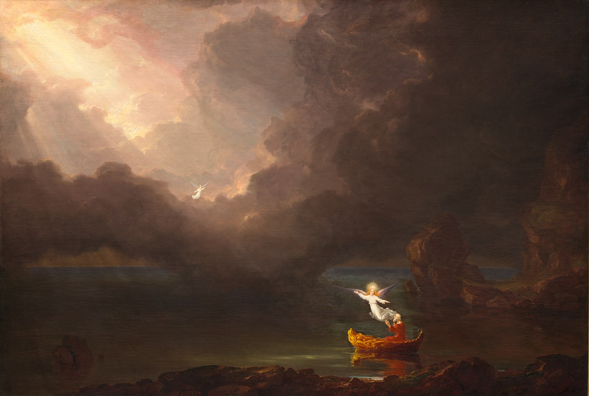

Many religions and self-help books suggest that there is one way to achieve a better and more virtuous life. For instance, there are the ten commandments in Christianity, the Five Pillars of Islam or the Noble Eightfold Path in Buddhism. Moreover, aside from core fundamental teachings, religions often feature thousands more; and of these, very few – if any – are presented as being optional. Islam for instance has the 75 Good Manners – but even these comprise only a small portion of all the rules presented. The Old Testament of Christianity alone is said to [contain more than 600 rules](https://www.abc.net.au/reslib/201407/r1308729_17984331.pdf).

I believe that religion fulfils a very important function for beings such as us; specifically transcendence, the experience, and connection to something that lies beyond the physical world. Transcendence is a critical experience since I think it is not possible to find satisfactory answers to questions such as 'what is the purpose of existence' and 'what is good and bad' within the physical realm; and without answers to these questions, our lives are but grey shadows of what they could be.

Unfortunately, major world religions provide a poor guide for transcendence for our modern world. First, their deep philosophical underpinnings contrast with our modern experience and knowledge. Both Christianity and Islam are based on direct communication with super-natural beings; something which modern knowledge requires us to question. Central to Buddhism is the idea of reincarnation; something which also warrants to be seen with scepticism based on what we have learned so far about the emergence of consciousness and identity.  

Moreover, a weakness of most religions is the aforementioned abundance of rules. Firstly, we can show that many rules contradict each other (and the same is true for the fundamental philosophical underpinnings; such as Christianity's difficult relationship with [the end of the world](https://www.atheists.org/activism/resources/biblical-contradictions/)). And, secondly, many of the rules just do not stand up to modern values or scientific knowledge. For instance, the Quran and the Bible contain some interesting directions for the treatment of women, and provide helpful rules for the proper place of slaves. 

Thus, we find ourselves at an intriguing place in history. Transcendence is a human need; yet the established approaches for achieving transcendence are tainted by our scientific and moral enlightenment. In the place of religions we have a hodgepodge of ideas borrowed from religions, self-help literature, common sense and individual preferences that is only held together by our ability to not think about things too deeply. 

In our multipolar, loud world, there is a bottomless well of ideas. Many of which are related to transcendence. Yet these ideas are often at the fringes of consensus and it is difficult to find good ideas among the cacophony of information.  

I think it is therefore a worthy undertaking to organise and condense the available wisdom on transcendence; in order to provide some guidance for us seeking a more meaningful and enlightened life. However, I think such a guide needs to be a map rather than a collection of commandments; something that gives us an understanding of the landscape of ideas but gives us the freedom to choose our own path. 

To give an example, many religions like to spell out what virtues we must aspire too. I think there is tremendous value in [striving for virtues](https://kamaltouhid.medium.com/the-ten-non-virtues-from-buddhist-doctrine-e96dd82d1f3f). However, following all virtues ever conceived could prove challenging. Some virtues will come more natural to some than others. Thus, I think a map that lays out what virtues there are, what is their value and how they are related can be very valuable in helping each one of us be a better version of ourselves; that plays to our individual strengths and alleviates our weaknesses.

I will endeavour to provide such a map. A project I have no doubt will take me many years to complete. Thankfully, I do not have to start from scratch since I have already read and categorised numerous books and quotes as well as having written some articles tangentially related to this subject. However, there is much more left to do than is already done.

Here are some of the topics that may be covered:

- [Virtues](https://maxrohde.com/2018/08/20/eight-virtues-which-seem-not-all-that-bad)
- [Our place in existence](https://maxrohde.com/2018/10/16/what-is)
- Good and bad
- Rules
- [Practices](https://maxrohde.com/2019/04/19/practices-for-enlightenment)

Be welcome to follow the _contemplations_ on this blog to stay abreast of my progress.
