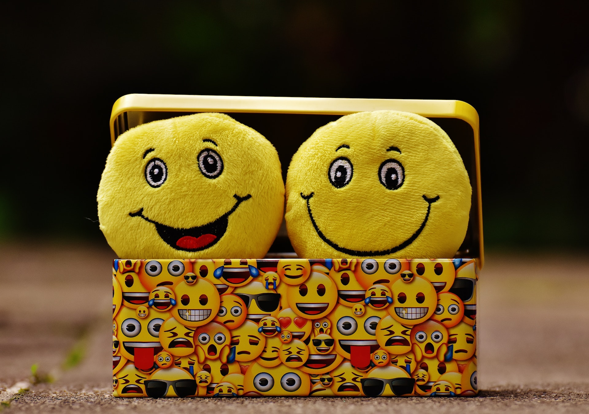

---
categories:
- book-reviews
- contemplations
coverImage: pexels-bruno-bueno-3854816.jpg
date: "2022-11-05"
id: make-it-stick-book-review
blog: maxrohde.com
publish: true
summary: Review and summary of the book Make It Stick by Chip and Dan Heath
tags:
- book-review
- memory
- book
- writing
- non-fiction
- business
title: Make It Stick - Book Review
---

[Make It Stick](https://www.goodreads.com/review/show/4866472090) is an excellent non-fiction book. It synthesizes large amounts of academic research into easy to apply guidelines for becoming better at communicating. Specifically, to compose messages that are easy to understand, remember and that spur people to act. Five attributes are suggested that messages should contain. I will list each of these attributes and the authors' suggestions to realise them below.

## Simple

Simple messages are easier to understand and remember than complex ones. Thus, we should aim to say what we want to say in a simple way. Unfortunately, this is easier said than done. The authors suggest a number of angles and examples to help us better understand simple messages:

- _Commander's Intent_ is a concept from military strategy. The idea is that each order is summarised in a simple one or two sentence intent that is prominently shown on the order. For instance, an order may include a complex set of movements that are required by a unit. Such as enter the town from the avenue on the northeast, establish cover, move south along the river etc. However, the key intent of these movements is spelled out explicitly. For instance, capture and control the town square.
- The _inverse pyramid_ is a concept from journalism. The idea is that the most important message of an article should always come in the beginning paragraphs, with the importance of what is discussed reducing as the article goes on. Thus, if something needs to be cut from the article, it is always clear that this will be the last paragraphs.
- The opposite of the inverse pyramid is the idea of _burying the lead_. This in journalism refers to making it difficult for readers to understand what an article is actually about.
- A key tool to making messages simple is drawing from things people already know. Familiar concepts are known in psychology as _schemas_. For instance, if one wanted to pitch the movie Aliens (before it was made) one could describe it as a movie about an alien in a spaceship. How it was actually pitched was as 'Jaws in Space', which gives a lot more information in a more compact form (we know it is a kind of horror movie with a scary creature at its centre, and it will lean more to the gritty than the sophisticated).
- A further concept is that messages should not just be simple but _simple_ and _compact_, to say a lot with little. For instance, the example of an editor for a local newspaper is given, who defined a concise mission for his newspaper: "Names, Names, Names". Implying that, most of all, he would like his writers to include as many local names as possible in the newspaper. This simple message can help with many different aspects of making the paper, such as which stories to include, what should go on the front page, and what kind of pictures should be included.
- A special category of simple and compact messages is given, _generative metaphors_. These are metaphors that can be used to provide guidance on a wide range of issues. For instance, workers in Disney theme parks are understood to be _performers_ going out on the _stage_; and this includes everyone, from restaurant staff to janitors.

## Unexpected

We remember the unexpected much better than the expected. For instance, if an alien spaceship were to land on your driveway, you would certainly remember that better than your partner parking after coming back from an errand (unless they do so in a spaceship). However, making a message unexpected often involves a bit more subtlety; since the message needs to be simple and compact and to the point as described in the previous section, thus adding superfluous fluff to make it more unexpected is usually not a good option. Here are some suggestions from the authors:

- _Insight_ is the feeling we get when we 'get something'. Insight is often unexpected and thus it is easier for us to remember something which we uncovered by having an insight than something which is presented to us plainly and directly. A good example is given of a teacher who asked his students to write an article for a student newspaper based on a planned trip of the faculty the following week Thursday. Plenty of information was given to the students, which they diligently summarised. After reviewing their answers, the teacher then gave his answer: "There is no school on Thursday". An angle of the story all students missed. This retrospective insight will make this a lot more memorable to the students.
- If something is a _mystery_ to us, we become a lot more invested into it, will give it more attention and eventually remember it better as well.
- In the previous section, I mentioned schemas, a concept from psychology describing an idea already familiar to us. A suggested way to make a message unexpected is to base it around the _violation of a schema_. For instance, we may think that the most effective way to fight many diseases is medication or surgery - and then demonstrate that diet alone can be as powerful as either. We are far more likely to remember this message if we held different beliefs previously.
- As much as the unexpected helps us to remember things, if something is too unfamiliar to us, it is not simple and compact anymore. To address this, the technique of _sequencing_ is proposed. Which is based around the idea that unfamiliar concepts are introduced in a thoughtful sequence one by one.

## Concrete

We remember the concrete better than the abstract. Thus, it is suggested to make messages more concrete if possible. However, often what we want to communicate is abstract, and we need to find ways to make the abstract more concrete. The authors discuss the following:

- Aesop's fables are given as an example of making abstract, complex ideas concrete.
- Another example is given of a charity trying to raise funding to protect an area of wilderness. The area in question was delineated geographically, but not well known to anyone under any particular name. Thus, the charity invited a name for the area "The Mount Hamilton Wilderness" and conceptualised this and other areas as landscapes.
- Why concreteness works is discussed by using the example of a strip of Velcro, where many little hooks are responsible for the two parts of the strip to connect - for our brain, concrete things are strong hooks that help us cling to new, related memories. Note this also relates to the schemas discussed above.
- Another example is given of the technology company HP, which was trying to get a new customer, specifically a theme park. Instead of producing decks of slides, they built a prototype apartment for a family that visited the theme park, placing objects into the apartment that would be reflective of the new experiences enabled by HP technology. This made an abstract project concrete by allowing stakeholders to _walk into_ the space, and interact with the ideas by _touching them_.

## Credible

While a message being concrete helps us to understand and remember it, it does not mean that we will believe it. Credible is the attribute of a message that makes us believe it, and there are a number of things we need to consider for this:

- A common strategy in marketing is to use celebrities or experts to boost the credibility of a message.
- Sometimes though, someone can boost the credibility of a message without being a celebrity or expert. Specifically, if a person is seen as honest and trustworthy we are more likely to believe what they have to say.
- We also give more credibility to a message that comes with vivid details. For example, the message "the bakery down the street makes the best bread" would be seen as less credible than the message "Yesterday I went to the bakery down the street and had a look inside, lured by the smell of freshly baked bread. And I am glad that I did, since the loaf I bought had the most delicious crunchy crust."
- It is generally difficult to make people care and trust numbers, since they are abstract. However, if we find a way to illustrate a statistic, that can be very powerful. For instance, to say you are 100 times more likely to die from a collision with a dear than to be bitten by a shark will be seen as a more credible message than to say, the chance to be bitten by a shark is one in a million.
- In the popular song _New York, New York_ by Frank Sinatra, one of the lines says that whoever makes it in New York can make it anywhere. This inspired the idea of the Sinatra Test. The idea is to subject a product or idea to a particularity difficult situation; and showing that it even succeeds under the harshest circumstances. For instance, when a new material is marketed, it would be a great boost in credibility if we could say: "Has been used in building the International Space Station". An example given in the book is that of a new process to colour textiles, usually a process involving toxic chemicals. However, the new process introduced was so clean, that the resulting fabric was so safe that was edible!
- Another way to improve credibility is by giving testable credentials: just see for yourself! The example is given of Wendy's burgers; they claimed their burger patties were substantially larger than the ones of their competitors and invited everyone to check the burgers out for themselves.

## Emotional

While making a message credible make us believe the message, it is far from guaranteed that we care enough about it to act. Making a message emotional can help make people care about the message and act on it. Again, there are a number of points discussed in relation to making messages emotional:

- Generally, we seem to approach things in either an analytical way or an emotional way. If we approach things analytically, we are far less likely to care and act on a message. The example is given of a charity trying to raise money to combat child poverty. While messages outlining the millions of children affected were generally not effective, those focussing on the fate of a single child made it far more likely for people to donate, since we can emotionally connect with the fate of a single child better than we can connect with the fate of millions.
- A trick of language that is sometimes used to make messages more emotional is that of semantic stretching. The idea here is that by choice of words to make something appear far more extraordinary than it is. We connect emotionally less with a statement like "Have a good day at our amusement park" than "Visit our park and have an experience you will cherish for the rest of your life" (if we believe that message though is another question).
- One thing that we care about is ourselves. Showing in a message how it has a personal impact on the recipient will lead to a more emotional connection with the message. It has been shown to be especially effective if people are asked to visualise a benefit they would be getting.
- However, as much as we care about ourselves, we seem to overestimate how much others value their basic needs. A good way to illustrate this is [Maslow's hierarchy of needs](https://en.wikipedia.org/wiki/Maslow%27s_hierarchy_of_needs) commonly expressed as a pyramid; where the base are matters of basic, selfish survival, and the higher tiers relate to more abstract goals such as contributing to the common good. In surveys, people consistently show they care a lot about the higher level goals, whereas they expect others to be driven by more base desires.
- Emotional meaning can even be given to the mundane, or the mundane can have emotional meaning. The example is given of the Pegasus canteen set in the blue zone in Iraq during the U.S. occupation. The chef in charge of this canteen made clear to his staff that their job was not to prepare food, but that they were in charge of morale. In effect, they tried to create an environment in which the soldiers feel comfortable, and this canteen was very popular with the troops.
- While we all can be a bit selfish sometimes, it has consistently been shown that many people vote against their own self-interest in elections. Instead, people vote according to what they think is the most beneficial for the group they identify with (and I assume there is a host of other factors at play as well). Thus, a message maybe even more emotionally powerful if it relates to a group rather than an individual.
- Two popular models to explain human behaviour are the rational and the social model. The rational model assumes we are what is called [Homo economicus](https://en.wikipedia.org/wiki/Homo_economicus), beings that rationally calculate how we benefit from certain actions and then act according to our best self-interest. The social model in contrast posits that we act in accordance with our social identity; we do what we think is expected of a person like us.

## Story-Driven

The last attribute of messages that are understandable, remembered and impactful according to _Make it Stick_ is that these messages are often couched in stories. Stories indeed often embody some of the other attributes, such as being concrete, unexpected and emotional. Here are some things to consider in relation to stories:

- A classic example from organisational research conducted by Julian E. Orr is presented: [the Xerox technician case](https://www.goodreads.com/book/show/724361.Talking_about_Machines). Technicians are observed during their break, and they talk about a particular issue that can be found in copy machines. However, instead of relating the knowledge in an abstract way, it is related as a story; as a sequence of events.
- A study is cited that showed that it is a very effective way for dealing with stressful situations if we revisit past events related to the situation in detail. Specifically, to concretely visualise what we have done, said and thought. This has been shown to be far more effective than us visualising how happy we would be when the stressful situation would be resolved.
- It has been shown that us imagining ourselves doing something and focussing on how we can do it better, is almost as effective as doing the thing itself. So, for instance, simply imagining how we were to hit the ball when playing a forehand in tennis can help us hit better forehands.
- Stories have been shown to be very immersive for us. Rather than listening to them passively, we seem to transplant ourselves into the story - imagine ourselves doing what the protagonists of the stories are doing. Thus, stories are such useful ways for us to learn and remember; since the best way to learn is by doing something, and imagining ourselves doing something has been shown to be the next best thing.
- A very successful marketing ploy of the fast-food chain Subway was to use the story of a man called Jared. This campaign related the story of Jared, who has heavily overweight, and discovered what he named the Subway-diet. On this diet, he lost hundreds of pounds, and the marketing campaigns of Subways simply relayed his story. Jared's story, it must be noted, has a rather [sad epilogue](https://medium.com/crimebeat/what-happened-to-jared-the-famous-subway-spokesperson-e294b4c3d889).
- The authors have conducted a study of archetypes for inspiring stories (there is a book series called [Chicken Soup for the Soul](https://www.chickensoup.com/) that contains such stories). They found that most inspiring stories fall into the following three archetypes: (1) Challenge plots, which focus on someone overcoming significant obstacles. (2) Connection plots, which are about people from different backgrounds coming together. (3) Creativity plots, which focus on someone finding a clever solution to a problem.
- Another type of story is also mentioned: [springboard stories](https://springboardstories.co.uk/). Such stories inspire us to see a situation in new ways and find new solutions to old problems.

While the authors say each of the five attributes proposed is desirable, a good message does not have to have all the attributes; just the more of these attributes a story has, the better. It is also acknowledged that composing stories with these attributes is not easy. What the authors suggest is that rather than trying to come up with messages that fulfil these attributes, it is often enough to keep one's eyes open to spot good messages. Very often these come in the form of stories, so one is well-advised to pay particular attention to stories one may encounter.

The authors also present a process by which we can create ideas that match these five attributes. First, we need to ensure that our ideas are simple (core and compact). Then we ensure that our audience:

- pays attention (aided by the attribute of being unexpected),
- understands the message (aided by it being simple and concrete),
- believes the message (aided by it being credible),
- cares about the message (aided by it being emotional), and
- acts (aided by the message being story-driven).

In remarks added in later editions of the book, the authors note that they regret having not spent enough time on the 'villains' of communication: chiefly the already mentioned 'curse of knowledge' - the idea that it becomes difficult for us to communicate something we have extensive knowledge about. There are also sections on how to apply the ideas of the book to defining business strategy as well as teaching; which are interesting but for the most part just re-iterate the ideas presented earlier.

Overall, I think _Make it Stick_ is an excellent non-fiction book and practices what it teaches. Complex problems are broken down into simple messages and key points are illustrated with stories. Although the book is short and easy to read, I actually took a very long time reading it. Since I was practising [my technique for remembering ideas and concepts](https://maxrohde.com/2022/10/28/how-to-remember-64-things-a-systematic-memory-system), and thus often went back and read sections multiple times. I think that was definitely worth it, since they are so many good ideas in the book that each deserve attention. I am very pleased with myself since I could compose this entire article just from what I had memorised. However, I am well aware that most of the hard work for this was done by Dan and Chip Heath, they really did an amazing job of making the presented ideas stick.